# Express JS

## Installing Express JS

First we need to install NPM,

    npm init -y

Next step is to install Express,

    npm i express

## What after Installation?: Creating our own Server

We can create our own server using Express JS. The following code does this for us,

```js
const express=require('express')// Importing Express
const app=express()// Creating a instance of express. Using this we will perform all the functions, such as routing, listening and etc.

app.use((req,res)=>{
    res.send('Hello There')
})

const port=3000//Setting up on which port the server is to be hosted.
app.listen(port,()=>{
    console.log(`Listening at localhost port ${port}`)
})
//This code will host the server and will wait to get requests from the user.
```

When this code will be executed, the terminal will look something like this.

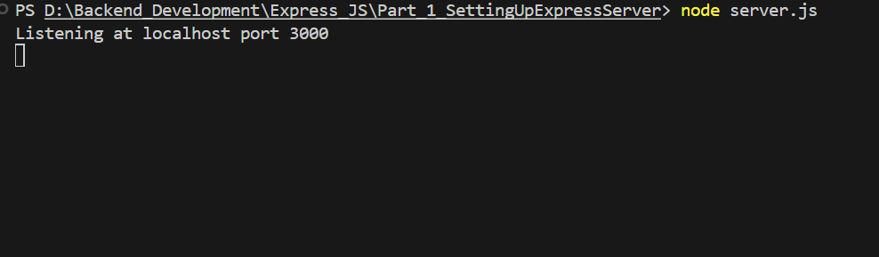

This signifies that server has started and is waiting for requests.

The server when sent request will look something like this,


Note that `req` and `res` are callback objects created by express that can be used for many functionalities.


### The use method

The `use` method is a universal request response method. It can send text on console or display it on server page, whenever a server hosted on a port is pinged, no matter which route is being pinged. The implementation of this method is as follows,

```js
const express=require('express')
const app=express()

//Setting up the use function
app.use(()=>{//Like intro, it can have req res objects too.
    console.log("Request recieved")//Sends response on terminal when server is pinged.

})

//Or
app.use((res,req)=>{
    console.log("Request Recieved")
    res.send("Hello There")//This will be shown on the server page in browser. This can hold strings, objects, html and etc.
})

const port=3000
app.listen(port,()=>{
    console.log(`Listening at localhost port ${port}`)
})
```

Note that `use` will not care on which route the request has been sent. If there is a request on the connecting port, `use` will do what use does.

When the port 3000 will be accessed, the terminal will look something like this.

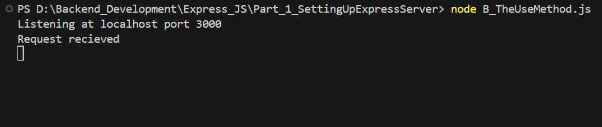


### Specific Requests and Responses: Routing

Till now we saw the usage of the use method that sent the same respone on any route when a server on a particular port is pinged. But what if we need specific responses for specific routes? For the we use methods such as `get` `post` `delete` `put` and etc. The all are HTTP verbs. Lets now look at thier implementations.

```js
const express=require('express')
const app=express()

//Following are our get routes.
//Home route
app.get("/",(req,res)=>{
    console.log("Home route")
    res.send("Hello to animal voice website")
})

//Cat route
app.get("/cat",(req,res)=>{
    console.log("Cat voice")
    res.send("Meow!!")
})

//Dog route
app.get("/dog",(req,res)=>{
    console.log("Dog voice")
    res.send("Woof!!")
})

//Universal Route. Kicks in when any other route other than / /cat and /dog are called upon
app.get("*",(req,res)=>{
    console.log("Universal Sound")
    res.send("This is an universal route")
})

const port=3000

app.listen(port,()=>{
    console.log("App running on port 3000")
})
```

The following are the send responses when GET request is sent on these routes.


The terminal will look something like this,

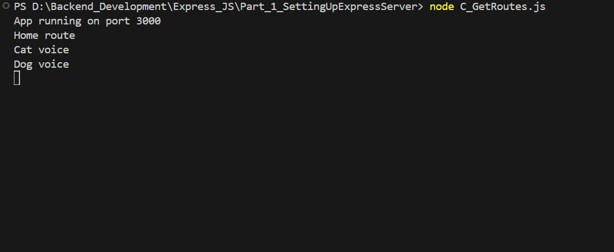

Any random route will kick in the universal route and it will look something like this,


And terminal looks something like this,

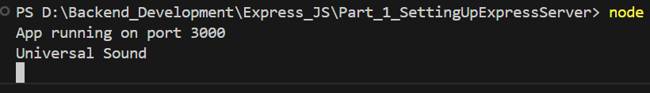


We can also add some post requests on specific routes. For example, for /cat route,

```js
const express=require('express')
const app=express()

//Following are our get routes.
//Home route
app.get("/",(req,res)=>{
    console.log("Home route")
    res.send("Hello to animal voice website")
})

//Cat route
app.get("/cat",(req,res)=>{
    console.log("Cat voice")
    res.send("Meow!!")
})

//Dog route
app.get("/dog",(req,res)=>{
    console.log("Dog voice")
    res.send("Woof!!")
})

//Universal Route. Kicks in when any other route other than / /cat and /dog are called upon
app.get("*",(req,res)=>{
    console.log("Universal Sound")
    res.send("This is an universal route")
})

//Creating POST request
app.post("/cat",(req,res)=>{
    console.log("POST Response")
    res.send("POST request recieved")
})

const port=3000

app.listen(port,()=>{
    console.log("App running on port 3000")
})
```

POST response when view via POSTMAN looks something like this,

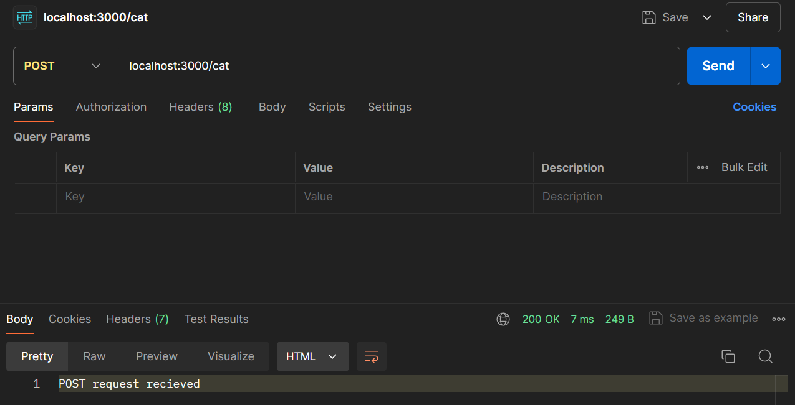

Note that on every ping, there can only we a single response (res.send).

### Express Path Parameters

Now we have created routes in the last part. But it is not possible to create a manual route for every page we are creating and this is where Path Parameters come into picture. So the code implementation and you will understand what is happening,

```js
const express=require('express')
const app=express()

//Following are our get routes.
//Home route
app.get("/",(req,res)=>{
    console.log("Home route")
    res.send("Hello to animal voice website")
})

//Now in a animal voice website there can be voices of many animals rather than just dog and cat. But its not feasable to create route for each and every animal. We will use path parameter and solve this issue of ours.

app.get("/voices/:animal",(req,res)=>{
    //To access path parameter use params method of req element

    const {animal}=req.params

    res.send(`Voice of ${animal}`)

    console.log(`${animal}`)

})//The :animal is the path parameter that will take different values.

const port=3000

app.listen(port,()=>{
    console.log("App running on port 3000")
})
```

When we send GET requests to different routes, the following output are seen.


The terminal looks something like this,

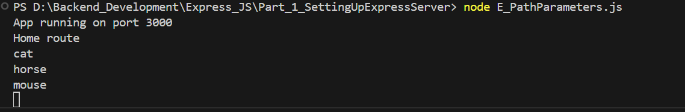

We can have multiple path parameters being fed in the same route. For instance, since there are many animals and they are different breeds, we are going to use two path parameters, `animal` and `breed`. See the code,

```js
const express=require('express')
const app=express()

//Following are our get routes.
//Home route
app.get("/",(req,res)=>{
    console.log("Home route")
    res.send("Hello to animal voice website")
})

app.get("/voices/:animal/:breed",(req,res)=>{

    const {animal,breed}=req.params

    res.send(`Voice of ${animal} of the breed ${breed}`)

    console.log(`${animal} and ${breed}`)

})
const port=3000

app.listen(port,()=>{
    console.log("App running on port 3000")
})
```

The output will be something like this,


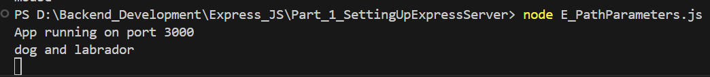

Since here we have only defined a single route such as /voices/:animal/:breed, any other route,
lets say, /voices/:animal will produce errors.

### Query Strings

When we see a normal URL, the general structure is , `www.example.com/home?tea=green`. This thing that appears after $?$ is known as Query String. We I guess cannot create a route that contains query string. But we can maybe create a route, add a query string by ourselves, access it and manage it. Note that to access a query string Express is its `request` object provides us the `.query` method.An examplar implmentation is as follows,

```js
const express=require('express')
const app=express()

app.get("/:animal",(req,res)=>{
    const {animal}=req.params

    //Accessing query string
    const {query}=req.query
    if(query){
        res.send(`Animal is ${animal} and query is ${query}`)
        console.log("Query Detected")
    }
    else{
        res.send(`No query no search`)
        console.log("Query not detected")
    }

    const port=3000
    app.listen(port,()=>{
        console.log("App is running")
    })
})
```

When running on postman we get the following output,

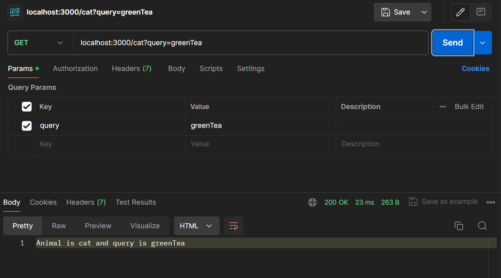

The terminal looks something like this,

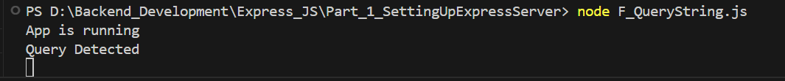

# Templating In Express JS

## Getting Started With EJS: Installation and Setup

This is the npm syntax that we use to install ejs,

    npm i ejs

ejs stands for embedded javascript. Its written in a .ejs file which is basically a html file with some javascript written into it using the ejs technique. How it works is something you will understand only after seeing the implementation of ejs in out code.

After installation of ejs we can then setup an basic express code, like we have done above. But for using and reading ejs, we will need to change the view engine to ejs and since we are talking about passing templates instead of strings, we will now see the functioning of `res.render`.

In the code below we see a html file which we will render on our express server.

```html
<!DOCTYPE html>
<html lang="en">
<head>
    <meta charset="UTF-8">
    <meta name="viewport" content="width=device-width, initial-scale=1.0">
    <title>Document</title>
</head>
<body>
    <h1>Hello there, this is the homepage</h1>
    <p>
        Lorem ipsum dolor sit amet consectetur adipisicing elit. Eveniet, ipsam. Perspiciatis cupiditate officiis, neque odit ab rerum consequuntur quibusdam doloremque eligendi modi! Possimus odit voluptatem excepturi, molestiae voluptatibus deleniti numquam?</p>
    <p>
        Lorem ipsum dolor, sit amet consectetur adipisicing elit. Aspernatur at repudiandae harum quis nulla asperiores, nihil culpa sit esse cupiditate quos vitae, natus, veniam rerum totam itaque similique animi voluptate.
    </p>
</body>
</html>
```

Following is the express code which will render this html file,

```js
const express=require('express')
const app=express()

app.set('view engine', 'ejs') //Setting up the view engine as talked before

app.get("/",(req,res)=>{
    res.render('home.ejs')//Note the default directory in which the render methods looks into is /views.
})

app.listen(3000,()=>{
    console.log("Running on port 3000")
})
```

Here is how the output will look,

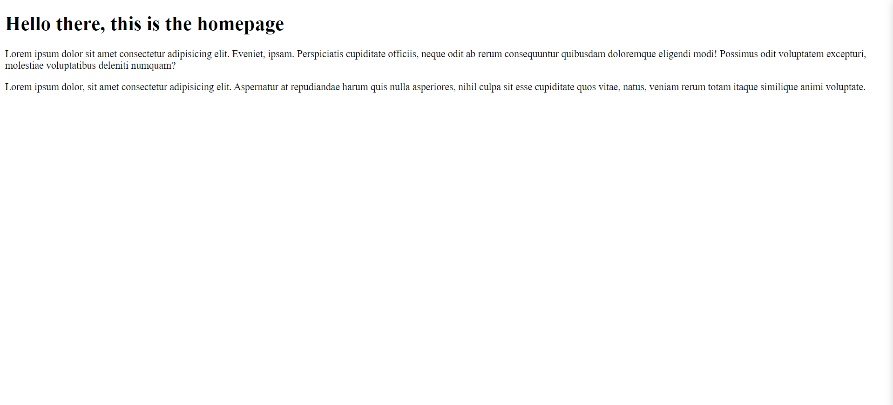

Now in the code we have mentioned how to render any template, the express js engine by default searches for that template in the view folder. One issue here is that it only searches for this folder in its current directory. For instance, the current directory of this code is Part_2_TemplatingInExpress. When node or nodemon will be called in this directory, no errors will be seen. But if in case we go to the main directory, that is, Express_JS, and run the code as in, nodemon ./Part_2_TemplatingInExpress, the template will not be loaded. To fix this we use the `path` library and the set method. See the code below.

```js
const express=require('express')
const path=require('path')

const app=express()

app.set('view engine', 'ejs')

app.set('views', path.join(__dirname,'/views'))//Here we are chaning path of views from only views to currentDirectory+views

app.get("/",(req,res)=>{
    res.render('home.ejs')
})

app.listen(3000,()=>{
    console.log("App is running on port 3000")
})
```

The output retains,

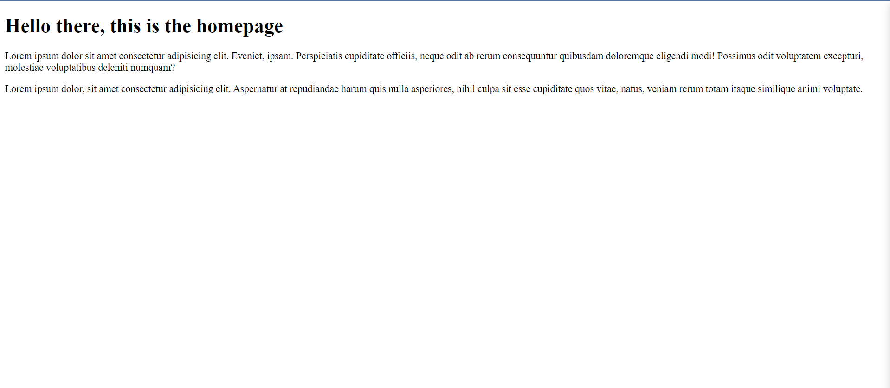

The terminal looks as follows,

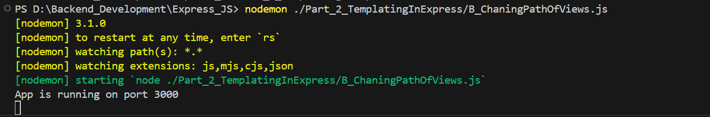

## Adding EJS to HTML

We use the following tags to add EJS to HTML,

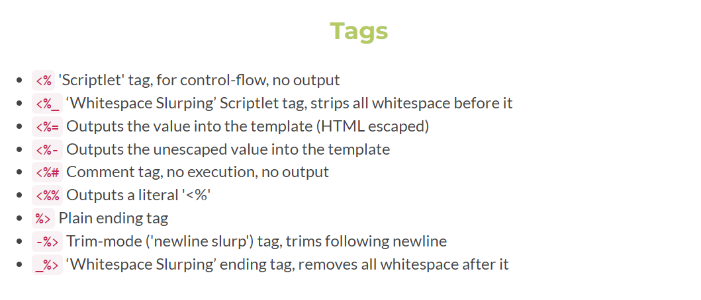


One of the most common EJS tags used includes, `<%=`. Whatever is stored in this tag is then parsed by JS and displayed on web screen. For instance see the following HTML code,

```html
<!DOCTYPE html>
<html lang="en">
<head>
    <meta charset="UTF-8">
    <meta name="viewport" content="width=device-width, initial-scale=1.0">
    <title>Document</title>
</head>
<body>
    <h1>Hello there, this is the homepage, This is page number <%= 5+1 %></h1>
```

This will be parsed by webpage as something like this,


## Passing Arguments Into EJS files From Express Server

See the code below to understand how it is done,

```js
const express=require('express')
const app=express()

app.set('view engine', 'ejs')

app.get('/',(req,res)=>{
    //Lets perform a mathematical operation
    let num=Math.floor(Math.random()*10)

    //We pass arguments in ejs file while rendering them. We make a key:value pair while having only the key accessible to the ejs end. See code.

    res.render('home.ejs',{num:num})
})

app.listen(3000,()=>{
    console.log("Port 3000 is running")
})
```

The output of the code comes out something like this,

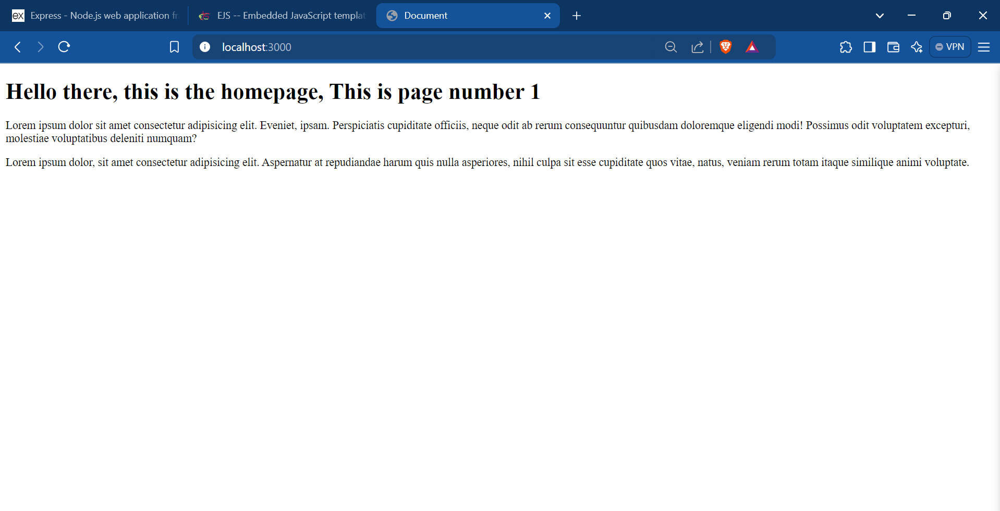   

## Conditionals In EJS

Conditionals? Well its the if-else thing that we already know. We can implement that in EJS too. See the code below to see and understand implementation.

The below that we are going to see is simple. We generate random numbers. The server will show odd and even depending on what the number actually is.

Note that for passing and working with conditionals on .ejs page, we use the `<%` tag in .ejs file.

```js
const express=require('express')
const app=express()

app.set('view engine', 'ejs')

app.get("/",(req,res)=>{
    let number=Math.floor(Math.random()*10)
    let conditional=false
    if(number%2==0){
        conditional=true
    }
    res.render('conditionals.ejs',{conditional:conditional,num:num})
})

app.listen(3000,()=>{
    console.log("The port 3000 is running")
})
```

The .ejs file looks something like this,

```html
<!DOCTYPE html>
<html lang="en">
<head>
    <meta charset="UTF-8">
    <meta name="viewport" content="width=device-width, initial-scale=1.0">
    <title>Document</title>
</head>
<body>
    <h1>The current number supplied is <%= num %></h1>

    <% if(conditional) { %>
        <h3>This number is even</h3>
    <%} else{ %>
        <h3>This number is odd</h3>
    <% } %>
</body>
</html>
```

The outputs can be seen as follows,

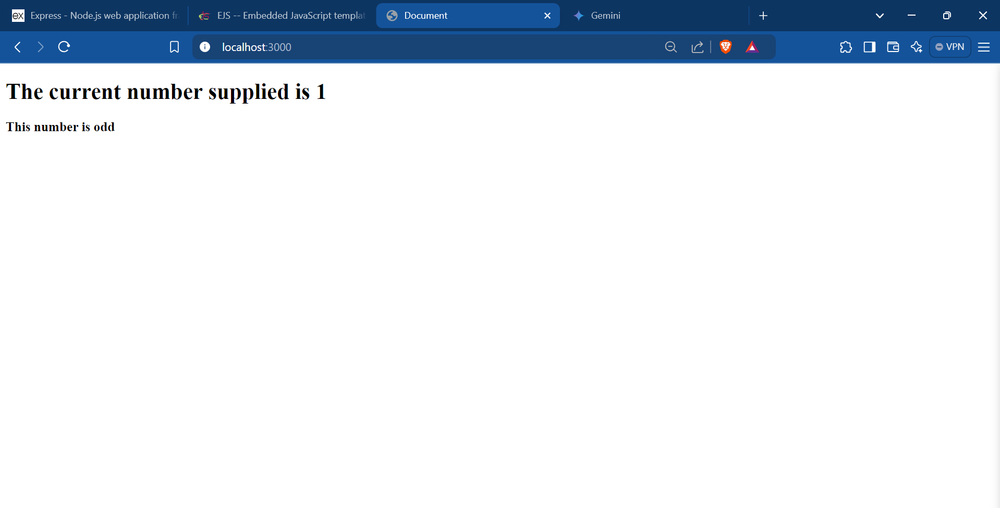


## Looping In EJS

Looping in Express and EJS is same as we know for other languages. for, while and etc are included in this. Looping is essentially useful when unpacking large bundled data, whether they are arrays, dictionaries or etc.

Following JS and EJS code snippets guide us through how to perform looping. The task we are performing is simple. Take a bunch of names are print them in the form of lists.

```js
const express=require('express')
const app=express()

app.set('view engine', 'ejs')

app.get("/",(res,req)=>{
    let arrays=['ashutosh','divyansh','dikshant','adarsh','shreyansh']

    res.render('looping.ejs',{list:arrays})
})

app.listen(3000,()=>{
    console.log("Port 3000 is running")
})
```

The supporting .ejs code looks something like this,

```html
<!DOCTYPE html>
<html lang="en">
<head>
    <meta charset="UTF-8">
    <meta name="viewport" content="width=device-width, initial-scale=1.0">
    <title>Document</title>
</head>
<body>
    <h1>This is the name of my friend</h1>
    <ol>
        <% for (let name of list) {%>
            <li><%= name %></li>
        <% } %> 
    </ol>
</body>
</html>
```

The output looks something like this,


## Partials In EJS

Suppose there are certain components used in certain a particular web page .ejs file that will be repeatedly used in other pages to. One way to repeatedly use this component is to copy paste the code. In that case if changes are made to parent code they will not show up on copied code. To solve this we can use `Partials`. See demonstration of how to we use `<%- %>` to implement partials. Suppose the nav bar code of a page is as follows,

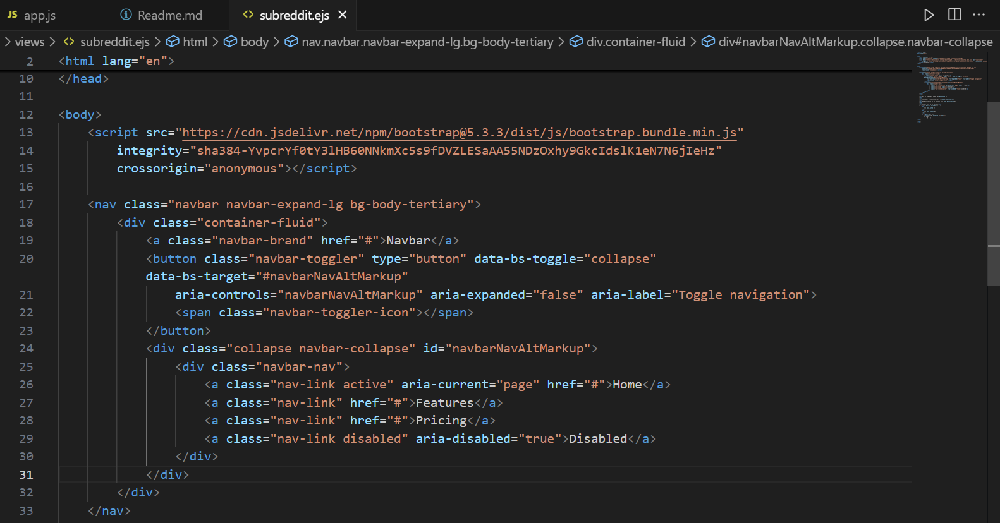

Next step is to create a `partials` folder in `views`. Create a navbar.ejs file there can copy the code of navbar there. Something like this.

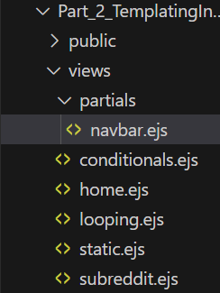

The copied code is here.

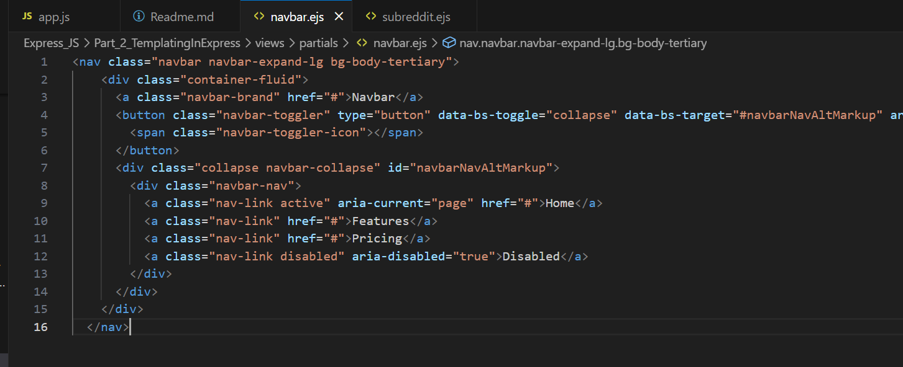

This is how this code will be reused in another file.

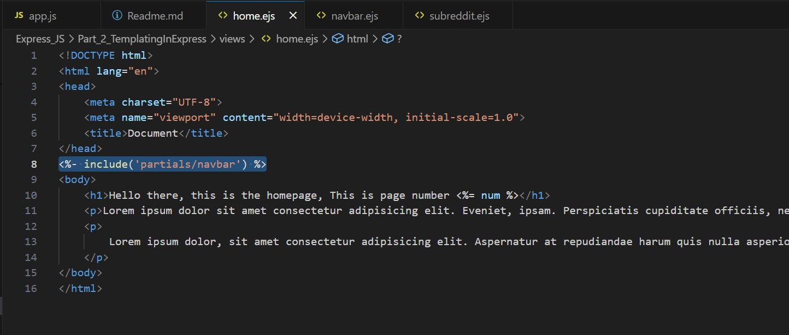

You can see the outputs after running them and find navbar in either of them.

## EJS-Mate

Now similar to the partial approach(not so similar), another way to process the EJS is using `ejs-mate`. Now lets understand how this work. For this we are going to use the YelpCamp project. The first step to create a `layout` folder in the views directory. Now in this we will create a file `boilerPlate.ejs`. This page or file will act as the basic template for the all the other pages. The boiler page code will be as follows,

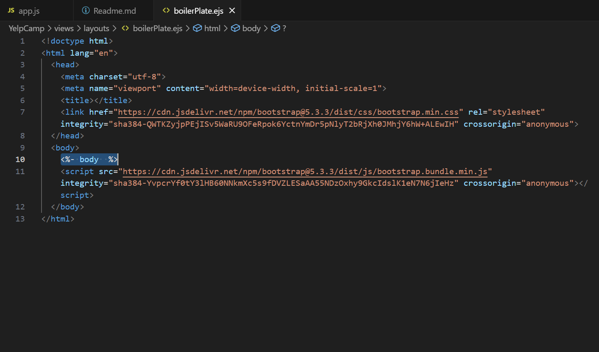

Note that how I have highlighted the `<%- body %>` part in the code. The is the part where we are going to place the body contents of various ejs pages via replacing them in original page. 

Now suppose the following is the original code for `campground.ejs` that is on the `/campground` route. 

```html
<!DOCTYPE html>
<html lang="en">
<head>
    <meta charset="UTF-8">
    <meta name="viewport" content="width=device-width, initial-scale=1.0">
    <title>Camp Grounds</title>
</head>
<body>
    <h1>All Camp Grounds</h1>
    <a href="/campground/create">Create New Camp Ground</a>
    <% for(let camp of campData) { %>
        <ul>
            <li>
                <%= camp.title %>
                <a href="/campground/<%= camp._id %>">Show Details</a>
            </li>
        </ul>    
    <% } %> 
</body>
</html>
```

Now we will make the following changes in this code,

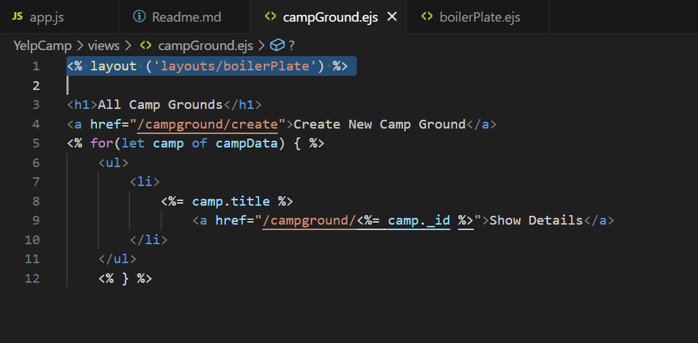

Yes the header and body tags are removed. This is because the are being derived via the <% layout('layout/boilerPlate.ejs') %> element. What lies below this element is captured by the <%- body %> element of the boilerPlate.ejs file.

What is the advantages of this?

The simple advantage is that for appearence wise changes we can simply make changes in the boilerPlate.ejs file in place of making them seperately on every file.

### Combining Everything We Have Learned Till Now

The task here is simple. There is a data.json file have content of different subreddits. Based on the search paramater passed in the URL, we need to display the data of the concerned subreddit. Following is the data.json file,

```json
{
    "soccer": {
        "name": "Soccer",
        "subscribers": 800000,
        "description": "The football subreddit. News, results and discussion about the beautiful game.",
        "posts": [
            {
                "title": "Marten de Roon to make pizza for more than 1,000 people in Bergamo if Atalanta win the Champions league.",
                "author": "joeextreme"
            },
            {
                "title": "Stephan Lichtsteiner has retired from professional football",
                "author": "odd person"
            },
            {
                "title": "OFFICIAL: Dani Parejo signs for Villareal.",
                "author": "joeextreme"
            }
        ]
    },
    "chickens": {
        "name": "Chickens",
        "subscribers": 23956,
        "description": "A place to post your photos, video and questions about chickens!",
        "posts": [
            {
                "title": "Naughty chicken hid under a shed for 3 weeks and came home with 25 chicks today!",
                "author": "joeextreme",
                "img": "https://preview.redd.it/pcn8u4j7c9z61.jpg?width=960&crop=smart&auto=webp&s=e114976dde1108b9556555d2db36a3cb6211798d"
            },
            {
                "title": "Had to kill my first chicken today. Does it get any easier?",
                "author": "sad boi"
            },
            {
                "title": "My five year old chicken set and hatched one baby. I guess she wanted to be a mama one more time.",
                "author": "tammythetiger",
                "img": "https://preview.redd.it/lervkuis3me51.jpg?width=640&crop=smart&auto=webp&s=6a18ab3c4daa80eccf3449217589b922fa443946"
            }
        ]
    },
    "mightyharvest": {
        "name": "Mighty Harvest",
        "subscribers": 44002,
        "description": "Feeding many villages and village idiots for 10s of days.",
        "posts": [
            {
                "title": "My first meyer lemon ripened today. Im so proud of the little guy. Banana for scale",
                "author": "proudmamma",
                "img": "https://preview.redd.it/1bz6we4j54941.jpg?width=640&crop=smart&auto=webp&s=a036ea99299f7737efde9f6c3bfa43893f5eaa00"
            },
            {
                "title": "I think I overestimated the harvest basket size I needed.",
                "author": "grower123",
                "img": "https://preview.redd.it/4h99osd25i351.jpg?width=640&crop=smart&auto=webp&s=d651250a345bbceeba7a66632e8c52a02d71bc73"
            }
        ]
    }
}   
```

Here is the express file we have developed,

```js
const express=require('express')
const app=express()
const redditData=require('./data.json')

app.set('view engine', 'ejs')

app.get('/:subreddit',(req,res)=>{
    const {subreddit}=req.params
    const data=redditData[subreddit]
    if(data){
        res.render('subreddit.ejs',{ data:data })
    }
    else{
        res.send("File not found")
    }
})

app.listen(3000,()=>{
    console.log("The port 3000 is running")
})
```

And here is our .ejs file,

```html
<!DOCTYPE html>
<html lang="en">
<head>
    <meta charset="UTF-8">
    <meta name="viewport" content="width=device-width, initial-scale=1.0">
    <title>Document</title>
</head>
<body>
    <h1>This is subreddit named <%= data.name %></h1>
    <h3>The number of subscriber are <%= data.subscribers %></h3>
    <h3>The description is as follows, <%= data.description %></h3>
    <h3>Content will be as follows</h3>
    <% for(let post of data.posts) { %>
        <h2><%= post.title %></h2>
        <h2><%= post.author %></h2>
        <% if(post.img) {%>
            " alt="">
        <% } %>
    <% } %>
</body>
</html>
```

The outputs are as follows,


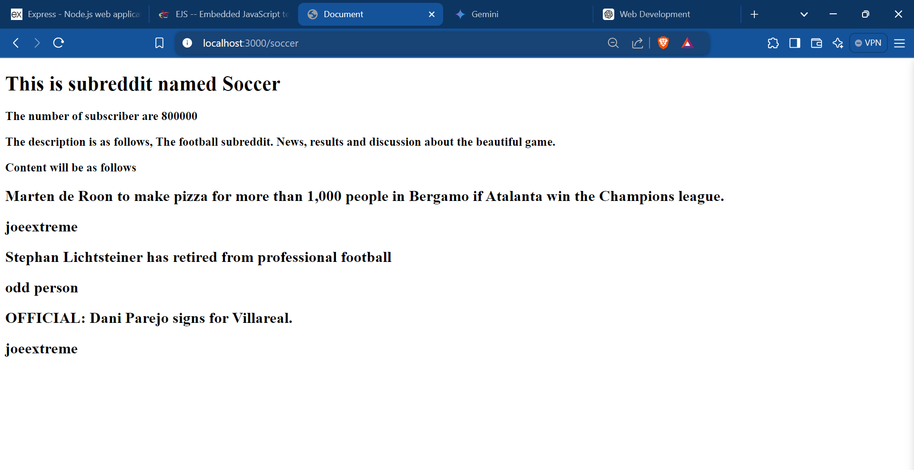


## Serving Static Pages In Express

Static pages are generally the CSS and JS files that are to be served along with the .ejs or HTML files to make it look functional. The code below shows how to serve static pages in express.

```js
const express=require('express')
const path=require('path')
const app=express()

app.set('view engine', 'ejs')

//To serve JS and CSS files linked to our main HTML file, we use .use method of express under which we use express.static and add the directory name in which the JS and CSS files are and then they are served into the webpage.

//app.use(express.static('public'))

//Like we did in case of views folder, for easy accessibility we can also use path method of express.

app.use(express.static(path.join(__dirname,'public')))


app.get("/",(req,res)=>{
    res.render('static.ejs')
})

app.listen(3000,()=>{
    console.log("Port 3000 is listening")
})
```

The CSS file in public directory is as follows,

```css
body{
    background-color: aqua;
}
```

The EJS file is as follows,

```html
<!DOCTYPE html>
<html lang="en">
<head>
    <meta charset="UTF-8">
    <meta name="viewport" content="width=device-width, initial-scale=1.0">
    <title>Document</title>
    <link rel="stylesheet" href="/style.css">
</head>
<body>
    <h1>This is a EJS file which is using statically served CSS file</h1>
</body>
</html>
```

The output is as follows,

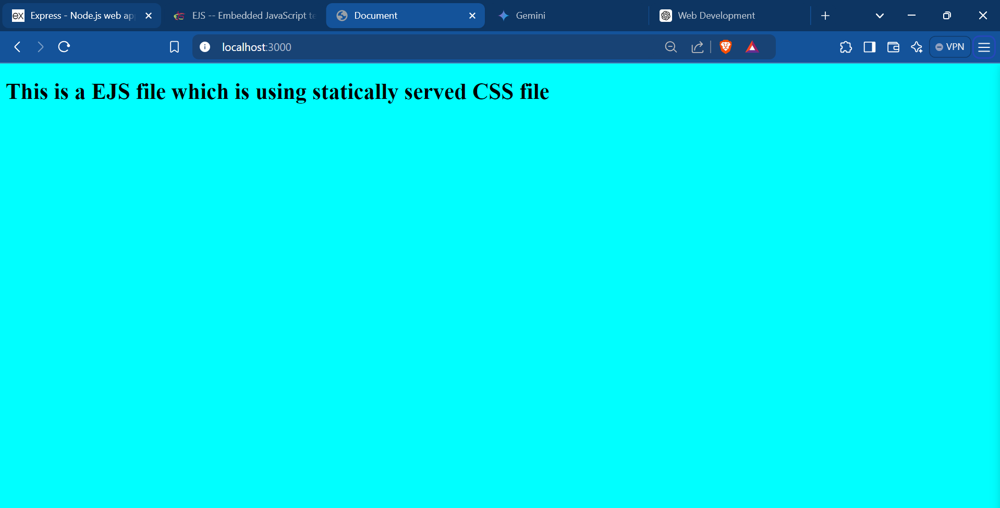

We can also view the CSS file, like this,

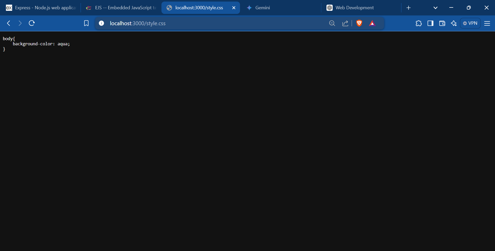


## GET vs POST

Get request are used for retrieving information while the post requests are used to send data to the server.

If we do what to sent some data via GET, its generally sent via `Query Strings`. Here in case of POST, the data is sent via `request body`. Note that since URL size is limited, limited data can be sent to server via query string. This is not the case with request body. Also, request bodies, are sercretive where as query strings are clearly visible.

Also we can send any sort of data, via POST, something which is not true for GET.

### An Example Of GET and POST request On The Same Page

Lets create a two forms in a .ejs file, one with method set as GET and the other with method set as POST. See the ejs file below,

```html
<!DOCTYPE html>
<html lang="en">
<head>
    <meta charset="UTF-8">
    <meta name="viewport" content="width=device-width, initial-scale=1.0">
    <title>Document</title>
</head>
<body>
    <h1>GET Method form</h1>
    <form action="/eggRoll" method="get">
        <input type="text" name="typeOfRoll" id="typeOfRoll">
        <input type="number" name="numberOfEggs" id="numberOfEggs">
        <button>Submit</button>
    </form>

    <h1>POST Method form</h1>
    <form action="/eggRoll" method="post">
        <input type="text" name="typeOfRoll" id="typeOfRoll">
        <input type="number" name="numberOfEggs" id="numberOfEggs">
        <button>Submit</button> 
    </form>
</body>
</html>
```

The corresponding express file handling post get and post requests from this page is as follows,

```js
const express=require('express')
const app=express()

app.set('view engine', 'ejs')

app.get('/eggRoll',(req,res)=>{
    res.send("Response to GET Request")
})

app.post('/eggRoll',(req,res)=>{
    res.send("Response to POST Request")
})

app.listen(3000,()=>{
    console.log("Port 3000 Running")
})
```

This the home page that we get during executions,


We fill the GET form something like this,


Now when we send a get request, we see the URL being formed something like this,


As we see whatever data we put into the form, the URL stored it as query strings.

Now what happens in case of POST request if we enter the same data?

See the following,


As discussed before, URL will not contain any information. Everything will be stored in the request body which remains secretive.

### How to we access and work with data recieved via POST?

For accessing data that is sent in Request Body via POST we use the `res.body` method. Do note that by default the output of this method is undefined and requires middleware for decoding. There are two middleware to decode such data. One is `express.urlencoded({extended:true})` and other is `express.json()`. We can use any of them or both of them as per the requirement. See the implementation of these below. 

Note that we are using the same ejs page we used in last instance.

The updated express js code is as follows,

```js
const express=require('express')
const app=express()

app.set('view engine', 'ejs')

app.use(express.urlencoded({extended:true}))

app.get('/',(req,res)=>{
    res.render('getPost.ejs')
})

app.get('/eggRoll',(req,res)=>{
    const {typeOfRoll,numberOfEggs}=req.query
    res.send(`You have ordered ${typeOfRoll} roll with ${numberOfEggs} eggs`)
})

app.post('/eggRoll',(req,res)=>{
    const {typeOfRoll,numberOfEggs}=req.body
    res.send(`You have ordered ${typeOfRoll} roll with ${numberOfEggs} eggs`)
})

app.listen(3000,()=>{
    console.log("Port 3000 is working")
})
```

Now this time if we send a post request with the same inputs as in the last case, we get the following output,


## REST and RESTFull Systems

REST stands for Representational State Transfer. Its an architectural style for distributed hypermedia system. Basically its a set of guildlines for how client + server should communicate and perform CRUD operations on a given resource.

The main idea of REST is to treat data on the server as resource that can be CRUDed. The most common way of approaching REST is in formatting the URLs and HTTP verbs in your application.

Then comes the term RESTFull system. The are system that follows the protocols setup by REST.

Below we are going to implement a RESTFull system. The resource we are going to perform CRUD operations will be comments and array containing the list of comments. We could have used database too, but for simplicity we are going to use array as our data base.

Now since we are going to implement a RESTFull System, we need to abide by the rules setup by REST and hence we need to define the routes that perform the different operations. The routes and thier operations will be as follows,

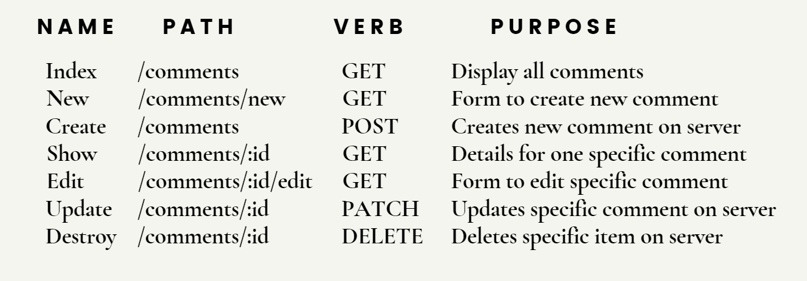

In the following code we are going to code all these routes.

```js
const express=require('express')
const app=express()
const methodOveride=require('method-override')

app.use(express.urlencoded({extended:true}))
app.set('view engine', 'ejs')
app.use(methodOveride('_method'))

//First lets prepare our array database
let comments = [
    {
        id:1,
        username: 'Todd',
        comment: 'lol that is so funny!'
    },
    {
        id:2,
        username: 'Skyler',
        comment: 'I like to go birdwatching with my dog'
    },
    {
        id:3,
        username: 'Sk8erBoi',
        comment: 'Plz delete your account, Todd'
    },
    {
        id:4,
        username: 'onlysayswoof',
        comment: 'woof woof woof'
    }
]

//This is the homescreen route
app.get("/",(req,res)=>{
    res.send("This is a CRUD on comments app")
})

//This is the view all comments route
app.get("/comments",(req,res)=>{
    res.render('commentsPage.ejs',{comments:comments})
})

//The next 2 are the add comments routes
//This sets us to the form to enter data
app.get("/comments/newComment",(req,res)=>{
    res.render('newComment.ejs')
})
//This handles the data entered
app.post("/comments",(req,res)=>{
    const {username,comment}=req.body
    comments.push({username,comment})

    //In place of res.send, we can add the comment and redirect to the updated comment page.
    //res.send("Comment Succesfull Added")
    res.redirect("/comments")
})

//The next route will take a specific id and show the corresponding comment
app.get("/comments/:id",(req,res)=>{
    const {id}=req.params
    res.render("show.ejs",{id:id,comments:comments})
})


//The next set of routes are there to work of patch request via which we can edit comments.
//The first route is to access form to edit text
app.get("/comments/:id/edit",(req,res)=>{
    const {id}=req.params
    let commentToSend;
    for(let comment of comments){
        if(id==comment.id){
            commentToSend=comment.comment
        }
    }
    res.render('edit.ejs',{id:id,comment:commentToSend})
})

//The next comment is to take the text in edit box, edit it, mount it over existing comment and edit it
app.patch("/comments/:id",(req,res)=>{
    const {commentEdit}=req.body//Name in the form and the name here should be the same
    const {id}=req.params
    for(let comment of comments){
        if(comment.id==id){
            comment.comment=commentEdit
            break
        }
    }
    res.redirect('/comments')
})

//Next we will be managing the delete routes
app.delete("/comments/:id",(req,res)=>{
    const {id}=req.params
    comments=comments.filter(c=>c.id!==id)
    res.redirect('/comments')
})


app.listen(3000,()=>{
    console.log("Port 3000 running")
})

```

We are going to see another example of RESTFUL Routes implementation but this its using Mongoose and MongoDB.

```js
const express=require('express')
const app=express()
const path=require('path')
const mongoose=require('mongoose')
const Product=require('./models/Model')
const methodOverride=require('method-override')

mongoose.connect("mongodb://localhost:27017/farmStand").then(()=>{
    console.log("Connection Established")
}).catch((err)=>{
    console.log("Connection Not Established")
    console.log(err)
})

app.set('view engine', 'ejs')
app.set('views', path.join(__dirname,'views'))
app.use(express.urlencoded({extended:true}))
app.use(methodOverride('_method'))

app.get("/product", async (req,res)=>{
    const products=await Product.find({})
    res.render("products.ejs",{products:products})
})

app.get("/product/create", (req,res)=>{
    res.render('createNewProduct.ejs')
})

app.post("/product", async(req,res)=>{
    const {productName,productPrice, productCategory}=req.body
    const newProduct=new Product({
        Name:productName,
        Price:productPrice,
        Category:productCategory
    })
    await newProduct.save()
    res.redirect("/product")
})

app.get("/product/:id/delete",(req,res)=>{
    res.send("Item deleted")
})

app.delete("/product/:id/delete", async (req,res)=>{
    const {id}=req.params
    await Product.deleteOne({_id:id})
    res.redirect("/product")
})

app.put("/product/:id", async(req,res)=>{
    const {id}=req.params
    const {productName,productPrice,productCategory}=req.body
    const product=await Product.findById(id)
    await Product.updateOne({_id:id},{$set:{
        Name:productName,
        Price:productPrice,
        Category:productCategory
    }})
    res.redirect(`/product/${id}`)
})

app.get("/product/:id/update", async(req,res)=>{
    const {id}=req.params
    const product=await Product.findById(id)
    res.render('update.ejs',{product:product})
})


app.get("/product/:id",async(req,res)=>{
    const { id } = req.params;
    const product = await Product.findById(id);
    res.render('show.ejs', {product});
})


app.listen(3000,()=>{
    console.log("App running at port 3000")
})
```

These two examples are more than enough to understand the implementation of RESTFull Routes in Express.js.

# Express Middlewares

Express middlewares are function that run during the request/repeat lifecycle. Each of these middlewares have the access to request and response objects. Middleware can end the HTTP request by sending back a response with methods like res.send(). Middlewares can also be chained together, one after the other by calling next().

One of the eassiet way to build a middleware is use `app.use`. Following instances will clear the implementation of middleware. 

## Using Predefined Middleware- Morgan- Logger Middleware 

The following code is example of us working with predefined middleware, morgan in this case,

```js
const express=require('express')
const morgan=require('morgan')
const app=express()

//Instance of using morgan
app.use(morgan('tiny'))

//Morgan has a next preinstalled to it. So it can execute .get command without any issue.
app.get("/",(req,res)=>{
    res.send("Hey Guyzz!!")
})

app.listen(3000);
```

The point of using this middleware is that it logs every request pinged at it.

For instance, 


## Defining Our Series Of Middlewares

The following code shows implementation of multiple middlewares, 

```js
const express=require('express')
const morgan=require('morgan')
const app=express()

//All the app.use and app.get represent middlewares. Using 'return next' is neccessary at the end of each of the 'app.use' or else the process will stop at one of the middleware with no 'return next()'. Also, res.send command sends response, and as soon as response is sent the cycle ends. If in case suppose we would have placed the 'app.get' between app.use middlewares, then after res.send command is executed(response) is sent, remaining app.use would not have been executed.

app.use((req,res,next)=>{
    console.log("This is first middleware")
    return next()
})
app.use((req,res,next)=>{
    console.log("This is the second middleware")
    return next()
})
app.use((res,req,next)=>{
    console.log("This is the third middleware")
    return next()
})

app.get('/',(req,res)=>{
    res.send("Hello There!!")
})

app.listen(3000);
```

The output seems as follows,

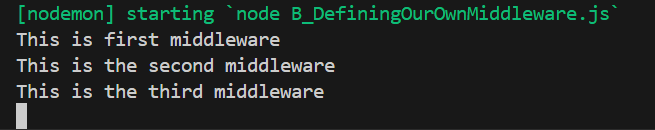

## Developing A Complex Middleware

Code is as follows,

```js
const express=require('express')
const app=express()

app.use((req,res,next)=>{
    req.requestTime=Date.now()
    console.log(req.method,req.path)
    return next()
})

app.get('/',(req,res)=>{
    console.log(req.requestTime)
    res.send("Hello There!!")
})

app.listen(3000)
```
The output is as follows,

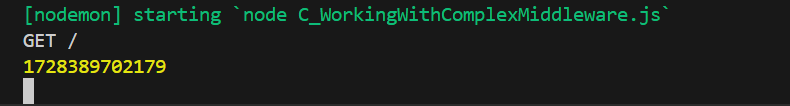

## Developing A 4O4 Error Route

```js
const express=require('express')
const app=express()

app.get('/',(req,res,next)=>{
    res.send("Home Page")
})
app.get('/dog',(req,res,next)=>{
    res.send("Dog Page")
})
app.get('/cat',(req,res,next)=>{
    res.send("Cat Page")
})

//This is the 404 route. Its always placed at the last or else it will get executed at every ping. All the pings at the route / /dog and /cat will execute sucessfully. On ping at any other route, this 404 route will execute.
app.use((req,res)=>{
    res.status(404).send("Not Found!!")
})

app.listen(3000);
```

## Query Authentication Using Middlewares

```js
const express=require('express')
const app=express()

//What we are going to do is simple. We create a secret. We will display it on a web page. But we will protect the route on which this secret is to be displayed. We will create password for verification. We will create a URL, and in that URL we will send a query, password. This password will be verified, and secret will be displayed. Else password wrong message will be displayed. 

app.get("/",(req,res)=>{
    res.send("This is homepage")
})

const verifyPassword=(req,res,next)=>{
    const {password}=req.query
    if(password=='iamsexy'){
        return next()
    }
    res.send("Wrong Password")
}

app.get("/secret",verifyPassword,(req,res)=>{
    res.send("My Secret is I love eating")
})

//Lets understand whats happening in the code above. The first route is the homepage route. Next is the function to check password's accuracy. When localhost:3000/secret?password= is called, password applied is checked by this function. If correct, next() is called, triggering GET on the /secret route. If wrong, "Wrong Password" is displayed. 

//Lets understand basic semantics. There are 2 callbacks being triggered here in the /secret GET route. The 'verifyPassword' and the normal callback. The 'verifyPassword' callback is executed first and then based on what happens in this callback, the next callback is called, sometimes not called.

app.listen(3000)
```

The outputs look as follows,


# Express Routers


In general when we an `app.js` file in express looks something like this.

```js
app.get("/",(req,res)=>{
    res.render('openingPage.ejs')
})
app.post("/login",async(req,res)=>{
    const {username,password} = req.body
    const usernameFound=await authorSchema.findOne({username:username})
    if(usernameFound){
        if(usernameFound.password==password){
            res.redirect(`/homepage/${username}`)
        }
        else{
            res.render('loginPage',{error:'Incorrect Password. Please Try Again'})
        }
    }
    else{
        res.render('loginPage',{error:'Something Went Wrong. Please Try Again'})
    }
})
app.post("/signup",async (req,res)=>{
    const {name,username,password,email}=req.body
    const blogger=new authorSchema({
        name:name,
        username:username,
        password:password,
        email:email
    })
    await blogger.save()
    res.redirect('/login')
})
app.post("/write/:username",async(req,res)=>{
    const {username}=req.params
    const {title,subtitle,content}=req.body
    const newBlog=new blogSchema({
        title:title,
        subtitle:subtitle,
        content:content,
        username:username
    })
    await newBlog.save()
    res.redirect(`../homepage/${username}`)
})
app.post("/forgetPassword",async(req,res)=>{
    const {email}=req.body
    const emailFound=await authorSchema.findOne({email:email})
    if(!emailFound){
        res.status(404).send('Email Not Found')
    }
    const password=emailFound.password
    sendPassword(email,password)

})
app.get("/login",(req,res)=>{
    res.render('loginPage.ejs',{error:null})
})
app.get("/signup",(req,res)=>{
    res.render('signupPage.ejs')
})
app.get("/homepage/:username",async(req,res)=>{
    const {username}=req.params
    const userdata=await authorSchema.findOne({username:username})
    const date=userdata.createdAt.toLocaleDateString()
    const time=userdata.createdAt.toLocaleTimeString()
    const blogData=await blogSchema.find({})
    res.render('homepage.ejs',{userdata:userdata,date:date,time:time,blogData:blogData})
})
app.get("/write/:username",(req,res)=>{
    const {username}=req.params
    res.render('write.ejs',{username:username})
})
app.get("/community/:username",async(req,res)=>{
    const {username}=req.params
    const blogData=await blogSchema.find({})
    res.render('community.ejs',{blogData:blogData,username:username})
})
app.get("/blog/:_id",async(req,res)=>{
    const {_id}=req.params
    const blogData=await blogSchema.findOne({_id:_id})
    const date=blogData.createdAt.toLocaleDateString()
    const time=blogData.createdAt.toLocaleTimeString()
    res.render('blog.ejs',{blogData:blogData,date:date,time:time})
})
app.get("/forgetPassword",(req,res)=>{
    res.render("forgotPassword.ejs")
})
```

As observable, it tends to have many routes. And the issue is that presence of that many routes makes it very difficult for us to read a program. To solve this issue, we have the concept of `Express Routers`.

To use this, note we work with two things. Firstly we create a `routes` folder, then add `.js` files to it. Secondly we have the main `app.js` file in main directory. 

Each of these `.js` files added to the `routes` folder will have routes that use common prefixes. This files will then be imported into the main `app.js` file. This will then be used using a middleware. To understand everything that has been said here, see the demonstration below.


Suppose we have the following code in `app.js` file.

```js
const express=require('express')
const app=express()

app.get("/campground/:username",async(req,res)=>{
    const {username}=req.params
    let campData=await campgroundSchema.find({})
    res.render('campGround.ejs',{campData:campData,username:username})
})
app.get("/campground/:username/create",(req,res)=>{
    const {username}=req.params
    res.render("addNewForm.ejs",{username:username})
})
app.get("/campground/:username/:id/edit",async(req,res)=>{
    const {username,id}=req.params
    const single_data=await campgroundSchema.findOne({_id:id})
    res.render('editForm.ejs',{single_data:single_data,username:username,id:id})
})
app.get("/campground/:username/:id/delete",async(req,res)=>{
    const {username,id}=req.params
    res.render("delete.ejs",{id:id,username:username})
})
app.get("/campground/:username/:id",async(req,res)=>{
    const {username,id}=req.params
    const reviewData=await reviewsSchema.find({locationid:id})
    const campData_single=await campgroundSchema.findOne({_id:id})
    res.render('showDetails.ejs',{campData_single:campData_single,username:username,id:id,reviewData:reviewData})    
})
app.get("/campground/:username/:id/review",async(req,res)=>{
    const {username,id}=req.params
    res.render('review.ejs',{username:username,id:id})
})

app.listen(3000)
```

Now in the code above we see that each of the route have this part in common, `/campground/:username`. So what can we do is, we can create a `route` folder, and create a `campground.js` file in it. In that file, we will write the following code,


```js
const express=require('express')
const app=express()
const router=express.Router()

router.get("/",async(req,res)=>{
    const {username}=req.params
    let campData=await campgroundSchema.find({})
    res.render('campGround.ejs',{campData:campData,username:username})
})
router.get("/create",(req,res)=>{
    const {username}=req.params
    res.render("addNewForm.ejs",{username:username})
})
router.get("/:id/edit",async(req,res)=>{
    const {username,id}=req.params
    const single_data=await campgroundSchema.findOne({_id:id})
    res.render('editForm.ejs',{single_data:single_data,username:username,id:id})
})
router.get("/:id/delete",async(req,res)=>{
    const {username,id}=req.params
    res.render("delete.ejs",{id:id,username:username})
})
router.get("/:id",async(req,res)=>{
    const {username,id}=req.params
    const reviewData=await reviewsSchema.find({locationid:id})
    const campData_single=await campgroundSchema.findOne({_id:id})
    res.render('showDetails.ejs',{campData_single:campData_single,username:username,id:id,reviewData:reviewData})    
})
router.get("/:id/review",async(req,res)=>{
    const {username,id}=req.params
    res.render('review.ejs',{username:username,id:id})
})
```

Now once our router file is ready we will go back to working with `app.js` file. Now all the routes we saw in the code above in `app.js` can be deleted. In place of that we will use a middleware, that will take 2 things, first the common prefix of all the routes in the router, and then the router itself. See the code below,

```js
const express=require('express')
const router=express.Router()
const app=express()
const campUsernameRouter=require('./routes/campground.js')

app.use('/campground/:username',campUsernameRouter)

app.listen(3000)
```

So this is how we use express routers for cleaning of code.

# Express Cookies

Cookies are little bits of information that are stored in a user's browser when browsing a particular website. 

Once cookie is set, the user's browser will send the cookie on every subsequent request to the site.

Cookies are used to make HTTP stateful which in defination is stateless.

Now the question arises that how to we work with cookies. How to send them? How to read them? and etc. So here is simple implementation.

```js
const express=require('express')
const app=express()

app.get('/',(req,res)=>{
    res.cookie('name','ashutosh')
    res.cookie('food','chola')
    res.send("Cookies are send!!")
})

app.listen(3000)
```
As observable, `res.cookies` is used to send cookies to the browser. This will take 2 attributes, `name` of the cookie and the `value` of cookie. Now we are done with how do we send cookies.

Understand this, all the cookies that a website sends are saved by the browser for that particular website, and as soon as website is changed the cookies utilised and displayed(in the application tab) are changed until they are trakers. (Cookies are always saved for all websites no matter which website you are accessing). 

Same will happen when we will work with `localhost:3000`. No matter what the route is, for instance `/` and `/about`, the cookies sent will be the same for all request no matter whether the cookies were sent by the `/` route or `/about` route since the net website, will always be `localhost:3000`. 

Now that we have seen how to send cookies, lets see how do we access it.

For that we first need to install `cookie-parser`.

    npm i cookie-parser

After the pakage is installed write the following basic code.

```js
const express=require('express')
const app=express()
const cookieParser=require('cookie-parser')

app.use(cookieParser())

app.get('/getCookies',(req,res)=>{
    const {name,food}=req.cookies
    console.log(`Cookie values are ${name} and ${food}`)
    res.send("Did you get the cookies?")
})
```

So in above code we import `cookie-parser` and add it to middleware just like we do in case of `url-encoded` that we need to read req.body contents. We access cookie of a website via `req.cookies` and we read that with help of `cookie-parser`.

Now lets talk about `Signing Cookies`. So what is `Signing Cookies`? Lets understand this with the help of a anology. Whenever we buy a jar of jam we see that it comes with a seal. And on that seal its written `Do not take if seal broken`. What the seal is actually doing here is that it is ensuring no one has interfered with the integrity of jam jar. Its similar in the case of `Signing Cookies`. We know that a website sends cookies to the client or the browser in this case. This is many times accessed by the server when the website is loaded on the client or the browser. At times, it becomes important that the value of the cookie is maintained as it was when saved and is not interfered with. To check whether the cookie is changed or not, we use the concept of `Signing Cookies` hence ensuring the integrity of cookie like jam.

Now how is this performed? See the code and the explaination that follows.

```js
const express=require('express')
const app=express()
const cookieParser=require('cookie-parser')

app.use(cookieParser('thisIsTheSecretCode'))

app.get("/",(req,res)=>{
    res.cookie('name','ashutosh')
    res.cookie('food','chola')
    res.cookie('fruit','apple',{signed:true})
    res.send("Cookies have been sent!!")
})

app.get("/access",(req,res)=>{
    res.send(req.cookies)
})

app.get("/accessSigned",(req,res)=>{
    res.send(req.signedCookies)
})

app.listen(3000)
```

Now lets understand what is happening in the code above. 

This time you might be observing that cookie-parser middleware is having some text. Well its nothing but encryption key followed to store cookie values. If its changed, all the cookies saved with this encryption key stop working.

Initially we see all the important libraries are being imported. Then from the home route, normal cookies and signed cookies are sent.

Now comes the cookie access routes. The output of `/access`looks something like this.

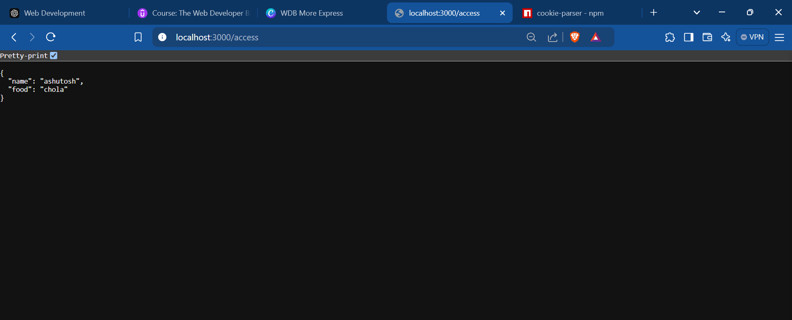

What is important to note is that there is no signed cookie being showed. For that we use a special route, that is `/accessSigned` that uses `req.signedCookie` rather than `req.cookies`. The output looks something like this,

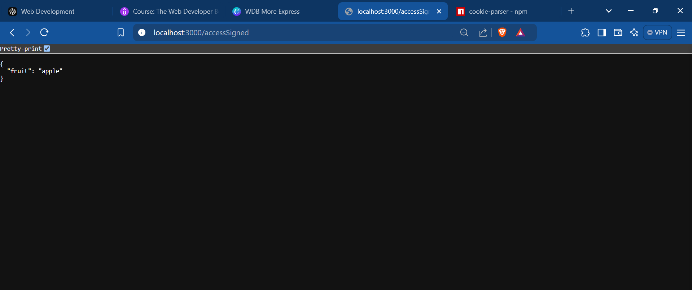

Now that this is clear. Lets talk about some extremeties. This is how the application tab of console looks on the previous page.

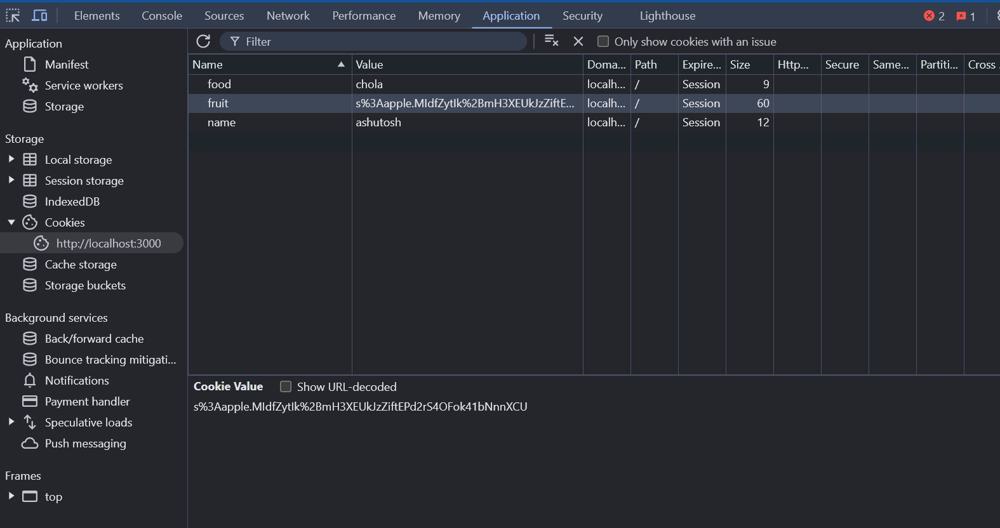

What if we delete the value of signed integer?

Well,

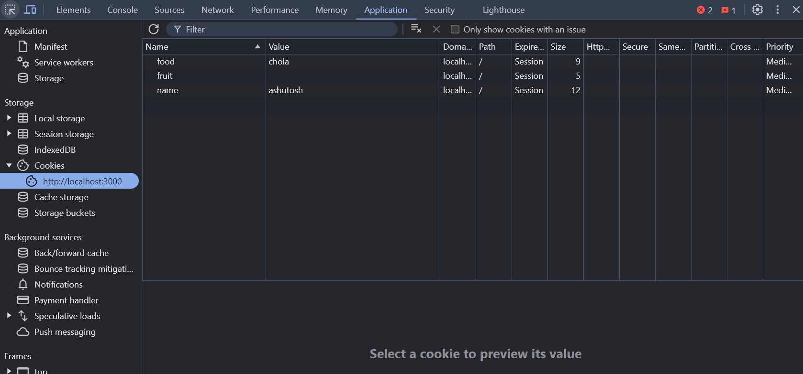

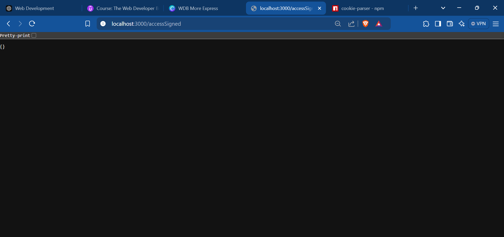


What if we change the value but not delete it?


Well,

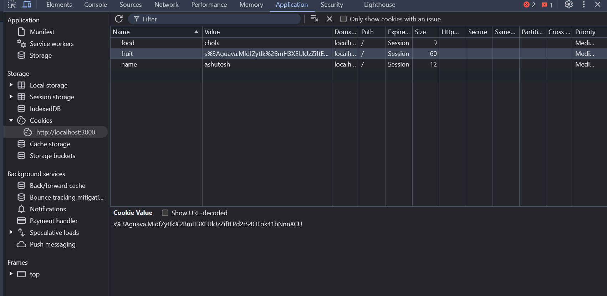

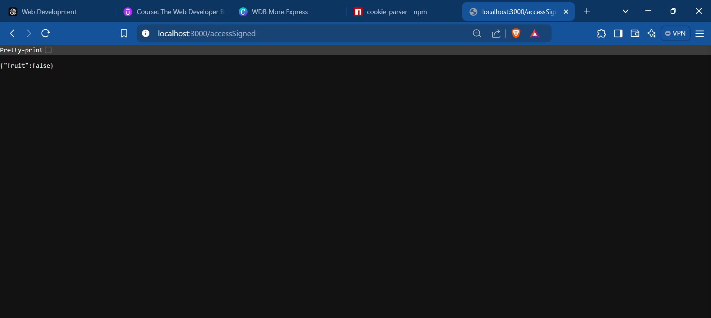

As we can see that signing cookies save integrity and report it if it is compromised.

# Express Sessions

Now let's talk about sessions. Sessions is kind of similar to cookies but is also different. Generally it is considered that its not correct to store lot of data on the client side(on the browser) using cookies to perform various functions.

This is where sessions come in. Sessions are a server-side data store that are used to make HTML stateful. Instead of storing data using cookies, we store data on server-side and then send the browser a cookie that generally contains the key that can be used by the client to retrieve data from the server. The following pictures explain this quite clearly.

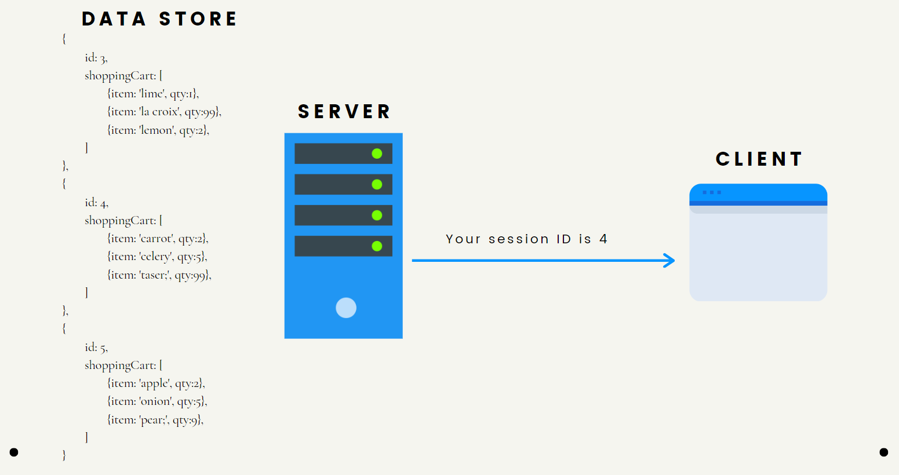

Lets understand what is happening here. Whenever we log on into e-commerce websites, we are not asked to login but are allowed to surf the site. User can surf the site and add objects they want to buy to the cart. But when BUY NOW is clicked, login is asked. 

But while all this is happening, how is the site able to keep the record of the user without login? how and where is the site storing the cart information without login?

Well all this happening via the help of sessions.

As soon as user enter the website, sessions assigns a session id to the user in the form of cookie. All the acts that user performs that generates data are stored on the server side in dataserver(in this case items added to the cart). But session id which is linked to the user on one end is also linked to data on dataserver on the other end and helps the website to maintain record of user and user cart.

Hence the transaction is quite simple. User enters the site is assigned some session id. User adds item to cart. Cart data is stored in the server but the data is linked to data id. Server assigned session id is then used by client to access data from dataserver.

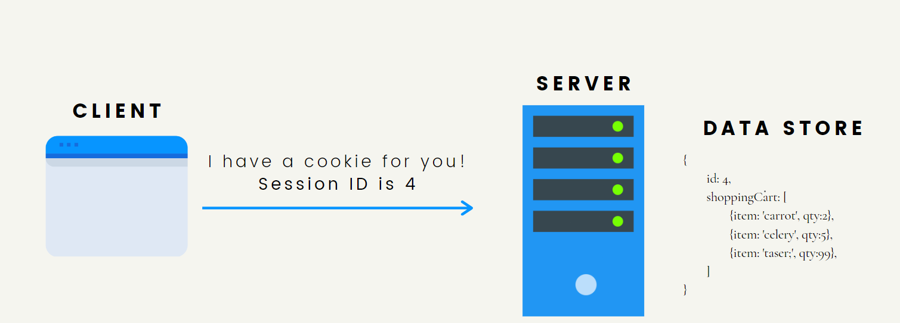

Now that the concept of sessions is clear. Lets now move onto the implementation.

The first thing that we need to do in order to work with sessions is to install the express-sessions pakage.

    npm i express-session

Now lets move onto the code.

```js
const express=require('express')
const session=require('express-session')
const app=express()

app.use(session({secret:"thisismysecret",resave:false,saveUninitialized:true}))

app.listen(3000)
```

Code is simple, express and express-session are imported. Since we require middleware to execute express sessions, we do it. This middleware takes 3 main things, secret, whose function is same as in case of cookie-parser, that is to create signed cookies. The other, resave and saveUninitialized should be studied from the this link, `https://www.npmjs.com/package/express-session`.

Now when this code is run, note that there are no routes but when we will open the application tab of dev tools we will see that there is a session id cookie assigned to us there called `connect-sid`.

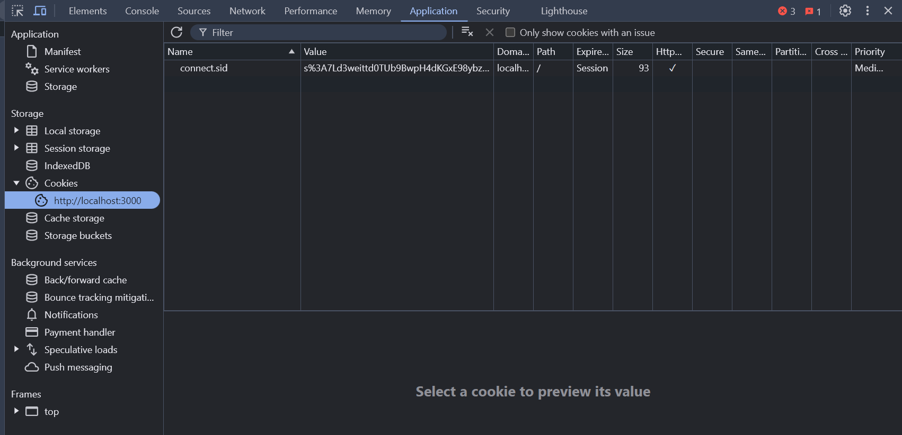

Now lets see how to we use express-sessions to retain information and access it around different routes. Note the session dataserver is the RAM memory in our case hence when server will be restarted, all the values will be lost.

Now lets see how to we create server side data storage using session and also how do we access this data.

```js
const express=require('express')
const session=require('express-session')
const app=express()

app.use(session({secret:"thisismysecret",resave:false,saveUninitialised:true}))


//Creating server side data object 'username' using session's 'req.session'
app.get('/register', (req, res) => {
    const { username = 'Anonymous' } = req.query;
    req.session.username = username;
    res.redirect('/greet')
})

//Accessing session serverside value using req.session
app.get('/greet', (req, res) => {
    const { username } = req.session;
    res.send(`Welcome back, ${username}`)
})

app.listen(3000, () => {
    console.log('listening on port 3000')
})
```

# Authentication

## Authentication vs Authorisation

| Authentication | Authorisation |
| --- | --- |
| Authentication is process of verifying who the user is. We typically authenticate with username/password combo, but we can also use security question, facial recognition and etc | Authorization is verifying what user has the access to. Generally we authorise after user has been authenticated. Its like now we know who you are, now here is what you can access and cannot access. |

## Signing Up and Rules Associated with it

* The basic rule while allowing user to create username and password is to ensure we as developers do not store password as plain text.

* Simple solution to this problem is using  `hashing` function. Hashing functions are functions that map input data of some arbitary size to fixed sized output. In simple terms these encode are password making it difficult for hackers to decipher password.  

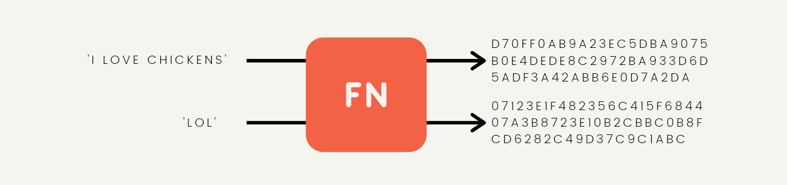

* Lets talk about flow of hashing. The user creates a account with username and password. User name is stored in the database as it is, but we then pass the password via hashing function, encrypt it, and  then store it in the database. When login attempt is made, a similar process is followed. User enter its username and password, password is then encrypted, it is then matched with the encryption stored in the database, then login is granted or blocked on the basis of matching.

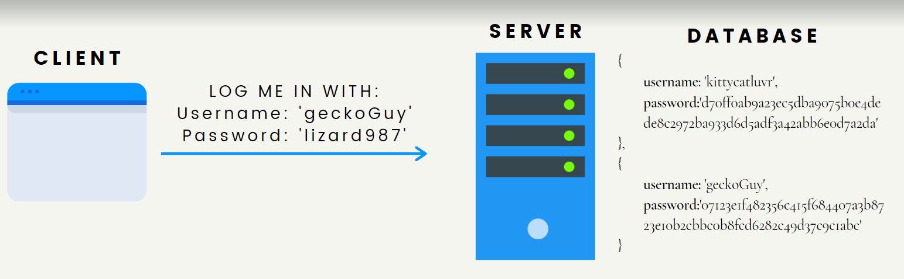

## What is a good hashing function?

* One-way function which is infeasable to invert. That is it should take input, encrypt it, but it should not be able decrypt the encrypted data.

* Small changes in input yields large change in the output.

* Should always generate the same encryption always for the same input.

* Should not generate the same encryption for different inputs.

* Should be deleberately slow.

## Password Salts

Now we have already discussed a lot about encryption of passwords to ensure safe authentication. Now lets look at another aspect of it.

For us to access any site, we need to create a account and that account requires username and password. What is seen is, though usernames are different, many at times, passwords turn out to be the same, hence the encryption which is saved in the database turn out to be same.

Now lets think with the perspective of a hacker. He can easily access list of common passwords and then he can simply guess the hashing function, use that function to generate encryption for most common used passwords and then match them against encryptions stored in the database resulting in compromise of data of many users.

To stop this we use what we call `Password Salts`. A salt is random value added to password before we hash it. 

What it ensures is that even though the base passwords are same, the encryption differ as there is different salt assigned to different passwords. Hence ensuring cracking of password one account do not result in hacking of many other accounts with the same password.

## Encryption Function: Hashing: Bcrypt

We talked all about encryption,hashing and salt till now in this journey of authentication. Lets now implement this. To implement this we are going to use javascript library `bcrypt`. Firstly we install bcrypt,

    npm i bcrypt

Now follow the code below,

```js
const express=require('express')
const app=express()
const bcrypt=require('bcrypt')

//This is the function that we will use for encryption. This function intially takes the word that need to be encrypted.
const encryptionFunction= async (word)=>{

    //Then salt is generated for that word.
    const salt=await bcrypt.gensalt(10)

    //Encryption is generated for that word and the salt added to it
    const hash=await bcrypt.hash(word,salt)
    
    //We print hash and salt
    console.log(`The encrypted hash is ${hash}`)
    console.log(`The generated salt is ${salt}`)
}
```

As you can see above we have performed basic encryption using bcrypt. The output looks as follows.


Now that we are clear in the front of generating salt and then generating the hashed password, the next thing we need to do is compare. Compare the hashed password stored in database and the password being entered by the user and then decide whether the password entered was correct or not.

See the code below to understand how does it work.

```js
const express=require('express')
const app=express()
const bcrypt=require('bcrypt')

async function main(){
    //Creating hashed password
    async function hashing(password){
        const salt= await bcrypt.genSalt(10)
        const hashing=await bcrypt.hash(password,salt)
        return(hashing)
    }

    const encryption=await hashing('password')

    //Comparing hash password and word password
    async function checkPassword(password,encryption){
        const same=await bcrypt.compare(password,encryption)
        return(same)
    }
    const isSame=await checkPassword('password',encryption)

    //Printing the verdict
    if(isSame){
        console.log("Password are correct")
    }
    else{
        console.log("Password are not correct")
    }
}
main()
```

As you can see we do the comparison with help of `compare` method.

## Express and Bcrypt

Now lets build an express app with bcrypt. We are going to have databases, protected routes login and signups and etc. Its going to be fun.

Lets first write our database model.

```js
const mongoose=require('mongoose')
const userSchema=new mongoose.Schema({
    username:{
        type:String,
        unique:true,
        required:true
    },
    password:{
        type:String,
        required:true
    }
})

module.exports=mongoose.model('userSchema',userSchema)
```

Next lets build the sign up page.

```html
<!DOCTYPE html>
<html lang="en">
<head>
    <meta charset="UTF-8">
    <meta name="viewport" content="width=device-width, initial-scale=1.0">
    <title>Document</title>
</head>
<body>
    <form action="/signup" method="post">
        <label for="username">Username</label>
        <input type="text" name="username" id="username" class="username"> <br>
        <label for="password">Password</label>
        <input type="password" name="password" id="password" class="password">
        <button>Sign Up</button>
    </form>
</body>
</html>
```

Next we build the login page.

```html
<!DOCTYPE html>
<html lang="en">
<head>
    <meta charset="UTF-8">
    <meta name="viewport" content="width=device-width, initial-scale=1.0">
    <title>Document</title>
</head>
<body>
    <form action="/login" method="post">
        <label for="username">Username</label>
        <input type="text" name="username" id="username" class="username"> <br>
        <label for="password">Password</label>
        <input type="password" name="password" id="password" class="password">
        <button>Sign Up</button>
    </form>
    <% if(error) {%>
        <p style="color:red">There was some issue.</p>
    <% } %>
</body>
</html>
```

Next we build our express app.

```js
const express=require('express')
const mongoose=require('mongoose')
const bcrypt=require('bcrypt')
const path=require('path')
const ejsMate=require('ejs-mate')
const sessions=require('express-session')
const userSchema=require('./models/userSchema')
const app=express()

mongoose.connect('mongodb://localhost:27017/authDemo').then(() => {
    console.log('MongoDB Database connected');
}).catch(err => {
    console.error('MongoDB Connection Error:', err);
});


app.set('view engine','ejs')
app.set('views',path.join(__dirname,'views'))
app.use(express.urlencoded({ extended: true }));
app.engine('ejs',ejsMate)
app.use(express.static(path.join(__dirname, 'public')));
app.use(sessions({secret:'thisisnotagoodpassword'}))

app.post("/signup",async(req,res)=>{
    const {username,password}=req.body
    const salt=await bcrypt.genSalt(10)
    const hash=await bcrypt.hash(password,salt)
    const newUser=new userSchema({
        username:username,
        password:hash
    })
    await newUser.save()
    res.redirect("/login")
})
app.post("/login",async(req,res)=>{
    const {username,password}=req.body
    const userFound=await userSchema.findOne({username:username})
    if(userFound){
        const isPassword=await bcrypt.compare(password,userFound.password)
        if(isPassword){
            req.session.user_id=userFound._id
            res.send("Correct Password")
        }
        else{
            res.render('login.ejs',{error:true})
        }
    }
    else{
        res.render('login.ejs',{error:true})
    }
})


app.get("/signup",(req,res)=>{
    res.render('signup.ejs')
})
app.get("/login",(req,res)=>{
    const error=false
    res.render('login.ejs',{error:error})
})

app.listen(3000)
```


# File Upload

Now we have worked with forms many at times and we have send and extracted data from them. But till now, we have not worked with sending and recieving files via form. The file can be anything, it could be a image, word file, pdf etc. So now lets take a look how could we achieve this.

The first change that we make is on the form itself. We are going to include a new attribute `enctype` and give it the value `multipart/form-data`. Something like this,

```html
<form action="/upload" method="post" enctype="multipart/form-data"></form> 
```

Now we know whenever we recieve data from a form we need a middleware to parse the data. Well the case is similar here. In order to parse a `multipart form` we need a middleware and that is called multer. To use multer we need to first install it.

    npm i multer

Then we need to require and initialise it mentioning the location we want the images to be save at under the `upload` variable which will be later used to initialise middlewares. 

Note that multer provides us two already built middlewares, `upload.single('_name of field__')` and `upload.array('__name of field__')`. The code below is a simple implementation of all this things,

First is a html page that takes single image `singleImage.ejs`,

```html
<!DOCTYPE html>
<html lang="en">
<head>
    <meta charset="UTF-8">
    <meta name="viewport" content="width=device-width, initial-scale=1.0">
    <title>Document</title>
</head>
<body>
    <form action="/singleImage" method="post" enctype="multipart/form-data">
        Username <input type="text" name="username" id="username"> <br>
        Password <input type="text" name="password" id="password"> <br>
        <input type="file" name="singleImageField" id="singleImageField">
    </form>
</body>
</html>
```

The page looks something like this,

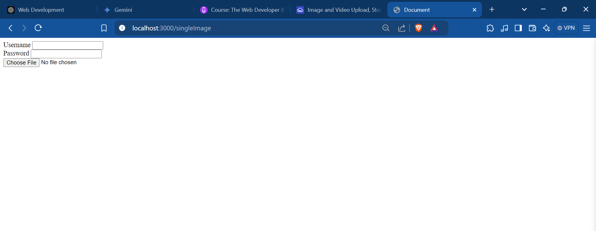

When upload option is click, we will be able to see that we are able to upload only one image at a time. This is because on this route we are using `upload.single` middleware. As we are able to see in `app.js`.

The multiupload page code is as follows, `multiImage.ejs`,

```html
<!DOCTYPE html>
<html lang="en">
<head>
    <meta charset="UTF-8">
    <meta name="viewport" content="width=device-width, initial-scale=1.0">
    <title>Document</title>
</head>
<body>
    <form action="/multiImage" method="post" enctype="multipart/form-data">
        Username <input type="text" name="username" id="username"> <br>
        Password <input type="text" name="password" id="password"> <br>
        <input type="file" name="multiImageField" id="multiImageField">
    </form>
</body>
</html>
```

The page looks something like this,

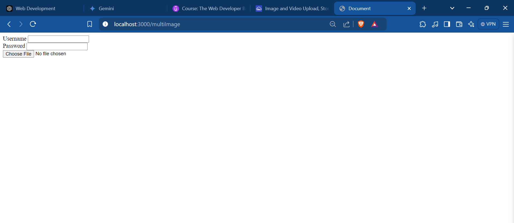

When upload option is click, we will be able to see that we are able to upload multiple images at a time. This is because on this route we are using `upload.array` middleware. As we are able to see in `app.js`.

Following is the server code, `app.js`,

```js
const express=require('express')
const multer=require('multer')
const ejsMate=require('ejs-mate')
const path=require('path')
const upload=multer({dest:'upload/'})
const app=express()


app.set('view engine','ejs')
app.set('views',path.join(__dirname,'views'))
app.use(express.urlencoded({ extended: true }));
app.engine('ejs',ejsMate)
app.use(express.static(path.join(__dirname, 'public')));


//Follow are post routes of forms sending a single and multiple image. The route design using multer will look something like this.

app.post("/singleImage",upload.single('singleImageField'),(req,res)=>{
    console.log(req.body,req.file)
})
app.post("/multiImage",upload.array('multipleImageField'),(req,res)=>{
    console.log(req.body,req.file)
})

//Follow are get routes of forms sending a single and multiple image. The route design using multer will look something like this.


app.get("/singleImage",(req,res)=>{
    res.render('singleImage.ejs')
})

app.get("/multiImage",(req,res)=>{
    res.render('multiImage.ejs')
})

app.listen(3000)
```

Lets work with `singleImage` route. When POST request is sent the output on console looks something like this,

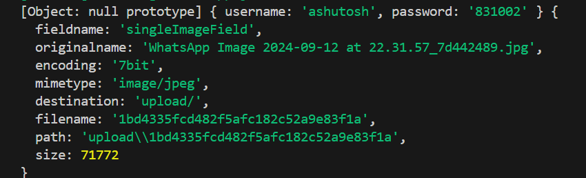

Lets work with `multiImage` route. When POST request is sent the output on console looks something like this,

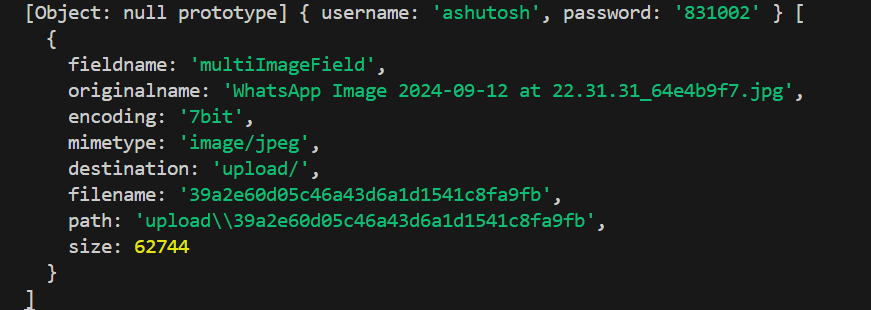

Note that there will be upload folder created to store the image files that are being uploaded. Something like this,

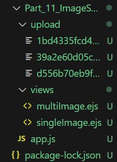

Now given all this we have talked about, when it comes to development, our process of storing the file is a bit different than the process we have used above, that is to store file locally on upload folder.

This time we are going to use cloud image storage services like `cloudinary` to store images.

Perform the following steps before proceeding,

* Go to cloudinary website.
* Login and create a account.
* Learn how to work with .env file to store all the secrets related to cloudinary account.

    Lets expand on this point. We generally use .env file to store secrets of any API we might be deploying for development and production purposes. The steps to use it are simple,

    * Create a .env file.
    * Install the .env pakage.
        ```
        npm i dotenv
        ```
    * Initailise the pakage in app.js.
        ```js
        if(process.env.NODE_ENV!=='production'){
            require('dotenv').config()
        }
        ```
    * Now if we want to use any of the secrets in .env file, we can use this syntax,
        ```js
        process.env.__NameOfSecret__
        ```

    This is all we needed to learn about env till this point.
* Now that we already know how to create .env file. Its time for us to store our secrets there. Once the cloudinary account has been created, we will see that it supplies us with three things, `CLOUD_NAME`, `API_KEY` and `SECRET`. We need to these three things in the .env file.

* Next step is to start working with uploading files into cloudinary. For the initially we need to install 2 important libraries, they are,
    ```
    npm i cloudinary
    npm i multer-storage-cloudinary
    ```
* Next step is to setup the application. The code to do so is as follows,
    ```js
    const cloudinary=require('cloudinary').v2
    const {CloudinaryStorage}=require('multer-storage-cloudinary')

    cloudinary.config({
        cloud_name:process.env.CLOUDINARY_CLOUD_NAME,
        api_key:process.env.CLOUDINARY_API_KEY,
        api_secret:process.env.CLOUDINARY_SECRET
    })

    const storage=new CloudinaryStorage({
        cloudinary,
        params:{
            folder:'demo',
            allowedFormats:['jpeg','avif','png','jpg']
        }
    })

    module.exports={
        cloudinary,
        storage
    }
    ```
* Next step is to import the exports of this file in our main file, app.js. We have already seen the code before. The changes made to it are as follows,
    ```js
    const express=require('express')
    const multer=require('multer')
    const ejsMate=require('ejs-mate')
    const path=require('path')
    //First we import exports from the cloudinary scripts here in the main server file.

    const {cloudinary,storage}=require('./cloudinary/index.js')

    //The second change is to be made here. We make changes in upload variable. In place of dest:'upload/' we place storage which we have imported from the original cloudinary config script. 
    const upload=multer({storage})
    const app=express()

    //Rest all of the code will remain the same.

    app.set('view engine','ejs')
    app.set('views',path.join(__dirname,'views'))
    app.use(express.urlencoded({ extended: true }));
    app.engine('ejs',ejsMate)
    app.use(express.static(path.join(__dirname, 'public')));


    app.post("/singleImage",upload.single('singleImageField'),(req,res)=>{
        console.log(req.body,req.file)
        res.send('See the console')
    })
    app.post("/multiImage",upload.array('multiImageField'),(req,res)=>{
        console.log(req.body,req.files)
        res.send('See the console')
    })


    app.get("/singleImage",(req,res)=>{
        res.render('singleImage.ejs')
    })

    app.get("/multiImage",(req,res)=>{
        res.render('multiImage.ejs')
    })

    app.listen(3000)
    ```
* Now that we have learned how to upload media to the cloudinary system, next step is to ensure storage of image links in the local database, so that the images can be used for our purposes. So lets create a demo database. The model is as follows,

