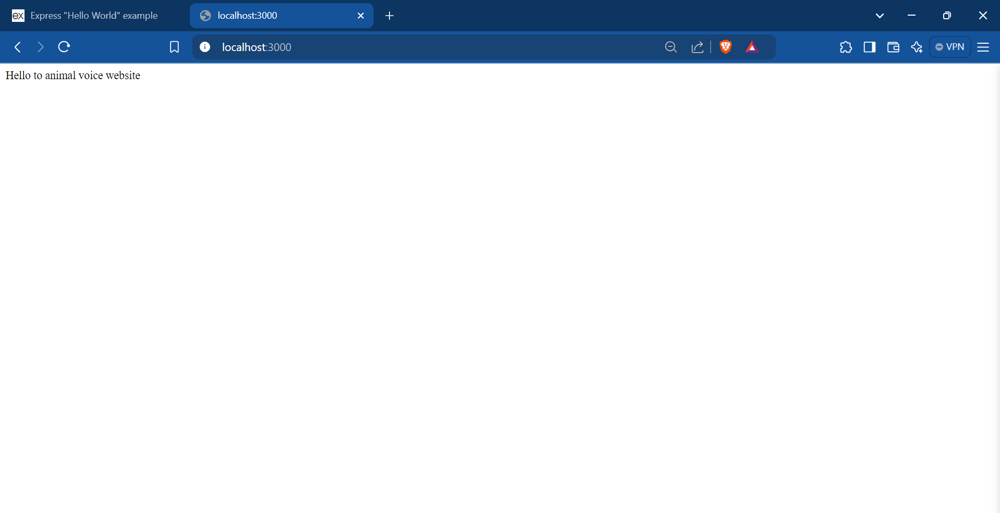
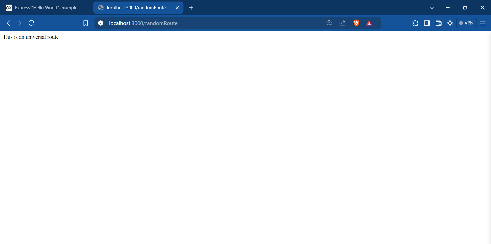
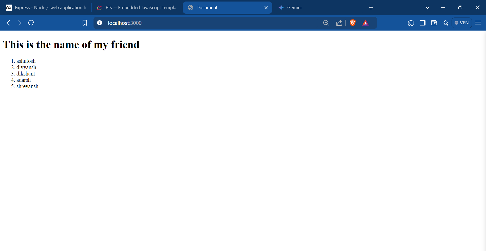
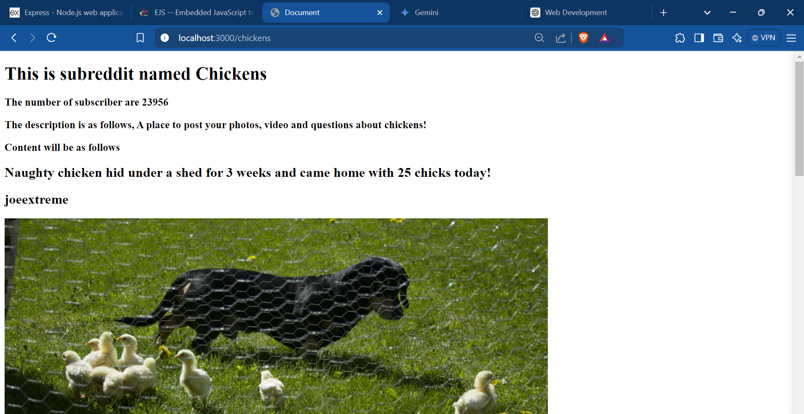
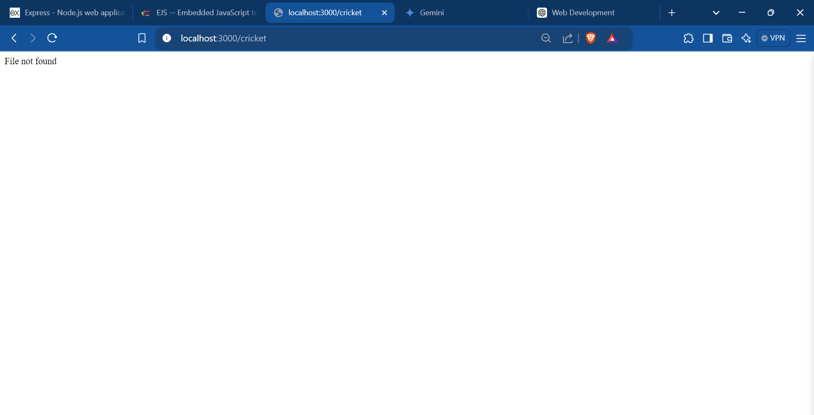
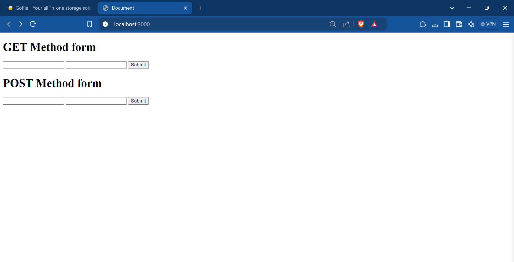
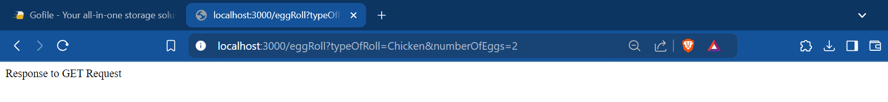
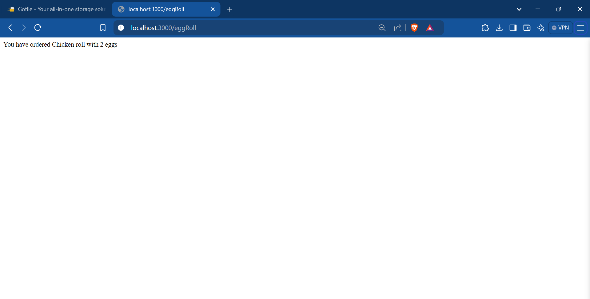

# Express JS

## Installing Express JS

First we need to install NPM,

    npm init -y

Next step is to install Express,

    npm i express

## What after Installation?: Creating our own Server

We can create our own server using Express JS. The following code does this for us,

```js
const express=require('express')// Importing Express
const app=express()// Creating a instance of express. Using this we will perform all the functions, such as routing, listening and etc.

app.use((req,res)=>{
    res.send('Hello There')
})

const port=3000//Setting up on which port the server is to be hosted.
app.listen(port,()=>{
    console.log(`Listening at localhost port ${port}`)
})
//This code will host the server and will wait to get requests from the user.
```

When this code will be executed, the terminal will look something like this.


This signifies that server has started and is waiting for requests.

The server when sent request will look something like this,


Note that `req` and `res` are callback objects created by express that can be used for many functionalities.


### The use method

The `use` method is a universal request response method. It can send text on console or display it on server page, whenever a server hosted on a port is pinged, no matter which route is being pinged. The implementation of this method is as follows,

```js
const express=require('express')
const app=express()

//Setting up the use function
app.use(()=>{//Like intro, it can have req res objects too.
    console.log("Request recieved")//Sends response on terminal when server is pinged.

})

//Or
app.use((res,req)=>{
    console.log("Request Recieved")
    res.send("Hello There")//This will be shown on the server page in browser. This can hold strings, objects, html and etc.
})

const port=3000
app.listen(port,()=>{
    console.log(`Listening at localhost port ${port}`)
})
```

Note that `use` will not care on which route the request has been sent. If there is a request on the connecting port, `use` will do what use does.

When the port 3000 will be accessed, the terminal will look something like this.


### Specific Requests and Responses: Routing

Till now we saw the usage of the use method that sent the same respone on any route when a server on a particular port is pinged. But what if we need specific responses for specific routes? For the we use methods such as `get` `post` `delete` `put` and etc. The all are HTTP verbs. Lets now look at thier implementations.

```js
const express=require('express')
const app=express()

//Following are our get routes.
//Home route
app.get("/",(req,res)=>{
    console.log("Home route")
    res.send("Hello to animal voice website")
})

//Cat route
app.get("/cat",(req,res)=>{
    console.log("Cat voice")
    res.send("Meow!!")
})

//Dog route
app.get("/dog",(req,res)=>{
    console.log("Dog voice")
    res.send("Woof!!")
})

//Universal Route. Kicks in when any other route other than / /cat and /dog are called upon
app.get("*",(req,res)=>{
    console.log("Universal Sound")
    res.send("This is an universal route")
})

const port=3000

app.listen(port,()=>{
    console.log("App running on port 3000")
})
```

The following are the send responses when GET request is sent on these routes.




The terminal will look something like this,


Any random route will kick in the universal route and it will look something like this,



And terminal looks something like this,


We can also add some post requests on specific routes. For example, for /cat route,

```js
const express=require('express')
const app=express()

//Following are our get routes.
//Home route
app.get("/",(req,res)=>{
    console.log("Home route")
    res.send("Hello to animal voice website")
})

//Cat route
app.get("/cat",(req,res)=>{
    console.log("Cat voice")
    res.send("Meow!!")
})

//Dog route
app.get("/dog",(req,res)=>{
    console.log("Dog voice")
    res.send("Woof!!")
})

//Universal Route. Kicks in when any other route other than / /cat and /dog are called upon
app.get("*",(req,res)=>{
    console.log("Universal Sound")
    res.send("This is an universal route")
})

//Creating POST request
app.post("/cat",(req,res)=>{
    console.log("POST Response")
    res.send("POST request recieved")
})

const port=3000

app.listen(port,()=>{
    console.log("App running on port 3000")
})
```

POST response when view via POSTMAN looks something like this,


Note that on every ping, there can only we a single response (res.send).

### Express Path Parameters

Now we have created routes in the last part. But it is not possible to create a manual route for every page we are creating and this is where Path Parameters come into picture. So the code implementation and you will understand what is happening,

```js
const express=require('express')
const app=express()

//Following are our get routes.
//Home route
app.get("/",(req,res)=>{
    console.log("Home route")
    res.send("Hello to animal voice website")
})

//Now in a animal voice website there can be voices of many animals rather than just dog and cat. But its not feasable to create route for each and every animal. We will use path parameter and solve this issue of ours.

app.get("/voices/:animal",(req,res)=>{
    //To access path parameter use params method of req element

    const {animal}=req.params

    res.send(`Voice of ${animal}`)

    console.log(`${animal}`)

})//The :animal is the path parameter that will take different values.

const port=3000

app.listen(port,()=>{
    console.log("App running on port 3000")
})
```

When we send GET requests to different routes, the following output are seen.


The terminal looks something like this,


We can have multiple path parameters being fed in the same route. For instance, since there are many animals and they are different breeds, we are going to use two path parameters, `animal` and `breed`. See the code,

```js
const express=require('express')
const app=express()

//Following are our get routes.
//Home route
app.get("/",(req,res)=>{
    console.log("Home route")
    res.send("Hello to animal voice website")
})

app.get("/voices/:animal/:breed",(req,res)=>{

    const {animal,breed}=req.params

    res.send(`Voice of ${animal} of the breed ${breed}`)

    console.log(`${animal} and ${breed}`)

})
const port=3000

app.listen(port,()=>{
    console.log("App running on port 3000")
})
```

The output will be something like this,


Since here we have only defined a single route such as /voices/:animal/:breed, any other route,
lets say, /voices/:animal will produce errors.

### Query Strings

When we see a normal URL, the general structure is , `www.example.com/home?tea=green`. This thing that appears after $?$ is known as Query String. We I guess cannot create a route that contains query string. But we can maybe create a route, add a query string by ourselves, access it and manage it. Note that to access a query string Express is its `request` object provides us the `.query` method.An examplar implmentation is as follows,

```js
const express=require('express')
const app=express()

app.get("/:animal",(req,res)=>{
    const {animal}=req.params

    //Accessing query string
    const {query}=req.query
    if(query){
        res.send(`Animal is ${animal} and query is ${query}`)
        console.log("Query Detected")
    }
    else{
        res.send(`No query no search`)
        console.log("Query not detected")
    }

    const port=3000
    app.listen(port,()=>{
        console.log("App is running")
    })
})
```

When running on postman we get the following output,


The terminal looks something like this,


# Templating In Express JS

## Getting Started With EJS: Installation and Setup

This is the npm syntax that we use to install ejs,

    npm i ejs

ejs stands for embedded javascript. Its written in a .ejs file which is basically a html file with some javascript written into it using the ejs technique. How it works is something you will understand only after seeing the implementation of ejs in out code.

After installation of ejs we can then setup an basic express code, like we have done above. But for using and reading ejs, we will need to change the view engine to ejs and since we are talking about passing templates instead of strings, we will now see the functioning of `res.render`.

In the code below we see a html file which we will render on our express server.

```html
<!DOCTYPE html>
<html lang="en">
<head>
    <meta charset="UTF-8">
    <meta name="viewport" content="width=device-width, initial-scale=1.0">
    <title>Document</title>
</head>
<body>
    <h1>Hello there, this is the homepage</h1>
    <p>
        Lorem ipsum dolor sit amet consectetur adipisicing elit. Eveniet, ipsam. Perspiciatis cupiditate officiis, neque odit ab rerum consequuntur quibusdam doloremque eligendi modi! Possimus odit voluptatem excepturi, molestiae voluptatibus deleniti numquam?</p>
    <p>
        Lorem ipsum dolor, sit amet consectetur adipisicing elit. Aspernatur at repudiandae harum quis nulla asperiores, nihil culpa sit esse cupiditate quos vitae, natus, veniam rerum totam itaque similique animi voluptate.
    </p>
</body>
</html>
```

Following is the express code which will render this html file,

```js
const express=require('express')
const app=express()

app.set('view engine', 'ejs') //Setting up the view engine as talked before

app.get("/",(req,res)=>{
    res.render('home.ejs')//Note the default directory in which the render methods looks into is /views.
})

app.listen(3000,()=>{
    console.log("Running on port 3000")
})
```

Here is how the output will look,


Now in the code we have mentioned how to render any template, the express js engine by default searches for that template in the view folder. One issue here is that it only searches for this folder in its current directory. For instance, the current directory of this code is Part_2_TemplatingInExpress. When node or nodemon will be called in this directory, no errors will be seen. But if in case we go to the main directory, that is, Express_JS, and run the code as in, nodemon ./Part_2_TemplatingInExpress, the template will not be loaded. To fix this we use the `path` library and the set method. See the code below.

```js
const express=require('express')
const path=require('path')

const app=express()

app.set('view engine', 'ejs')

app.set('views', path.join(__dirname,'/views'))//Here we are chaning path of views from only views to currentDirectory+views

app.get("/",(req,res)=>{
    res.render('home.ejs')
})

app.listen(3000,()=>{
    console.log("App is running on port 3000")
})
```

The output retains,


The terminal looks as follows,


## Adding EJS to HTML

We use the following tags to add EJS to HTML,


One of the most common EJS tags used includes, `<%=`. Whatever is stored in this tag is then parsed by JS and displayed on web screen. For instance see the following HTML code,

```html
<!DOCTYPE html>
<html lang="en">
<head>
    <meta charset="UTF-8">
    <meta name="viewport" content="width=device-width, initial-scale=1.0">
    <title>Document</title>
</head>
<body>
    <h1>Hello there, this is the homepage, This is page number <%= 5+1 %></h1>
```

This will be parsed by webpage as something like this,


## Passing Arguments Into EJS files From Express Server

See the code below to understand how it is done,

```js
const express=require('express')
const app=express()

app.set('view engine', 'ejs')

app.get('/',(req,res)=>{
    //Lets perform a mathematical operation
    let num=Math.floor(Math.random()*10)

    //We pass arguments in ejs file while rendering them. We make a key:value pair while having only the key accessible to the ejs end. See code.

    res.render('home.ejs',{num:num})
})

app.listen(3000,()=>{
    console.log("Port 3000 is running")
})
```

The output of the code comes out something like this,

   

## Conditionals In EJS

Conditionals? Well its the if-else thing that we already know. We can implement that in EJS too. See the code below to see and understand implementation.

The below that we are going to see is simple. We generate random numbers. The server will show odd and even depending on what the number actually is.

Note that for passing and working with conditionals on .ejs page, we use the `<%` tag in .ejs file.

```js
const express=require('express')
const app=express()

app.set('view engine', 'ejs')

app.get("/",(req,res)=>{
    let number=Math.floor(Math.random()*10)
    let conditional=false
    if(number%2==0){
        conditional=true
    }
    res.render('conditionals.ejs',{conditional:conditional,num:num})
})

app.listen(3000,()=>{
    console.log("The port 3000 is running")
})
```

The .ejs file looks something like this,

```html
<!DOCTYPE html>
<html lang="en">
<head>
    <meta charset="UTF-8">
    <meta name="viewport" content="width=device-width, initial-scale=1.0">
    <title>Document</title>
</head>
<body>
    <h1>The current number supplied is <%= num %></h1>

    <% if(conditional) { %>
        <h3>This number is even</h3>
    <%} else{ %>
        <h3>This number is odd</h3>
    <% } %>
</body>
</html>
```

The outputs can be seen as follows,


## Looping In EJS

Looping in Express and EJS is same as we know for other languages. for, while and etc are included in this. Looping is essentially useful when unpacking large bundled data, whether they are arrays, dictionaries or etc.

Following JS and EJS code snippets guide us through how to perform looping. The task we are performing is simple. Take a bunch of names are print them in the form of lists.

```js
const express=require('express')
const app=express()

app.set('view engine', 'ejs')

app.get("/",(res,req)=>{
    let arrays=['ashutosh','divyansh','dikshant','adarsh','shreyansh']

    res.render('looping.ejs',{list:arrays})
})

app.listen(3000,()=>{
    console.log("Port 3000 is running")
})
```

The supporting .ejs code looks something like this,

```html
<!DOCTYPE html>
<html lang="en">
<head>
    <meta charset="UTF-8">
    <meta name="viewport" content="width=device-width, initial-scale=1.0">
    <title>Document</title>
</head>
<body>
    <h1>This is the name of my friend</h1>
    <ol>
        <% for (let name of list) {%>
            <li><%= name %></li>
        <% } %> 
    </ol>
</body>
</html>
```

The output looks something like this,



## Partials In EJS

Suppose there are certain components used in certain a particular web page .ejs file that will be repeatedly used in other pages to. One way to repeatedly use this component is to copy paste the code. In that case if changes are made to parent code they will not show up on copied code. To solve this we can use `Partials`. See demonstration of how to we use `<%- %>` to implement partials. Suppose the nav bar code of a page is as follows,


Next step is to create a `partials` folder in `views`. Create a navbar.ejs file there can copy the code of navbar there. Something like this.


The copied code is here.


This is how this code will be reused in another file.


You can see the outputs after running them and find navbar in either of them.

## EJS-Mate

Now similar to the partial approach(not so similar), another way to process the EJS is using `ejs-mate`. Now lets understand how this work. For this we are going to use the YelpCamp project. The first step to create a `layout` folder in the views directory. Now in this we will create a file `boilerPlate.ejs`. This page or file will act as the basic template for the all the other pages. The boiler page code will be as follows,


Note that how I have highlighted the `<%- body %>` part in the code. The is the part where we are going to place the body contents of various ejs pages via replacing them in original page. 

Now suppose the following is the original code for `campground.ejs` that is on the `/campground` route. 

```html
<!DOCTYPE html>
<html lang="en">
<head>
    <meta charset="UTF-8">
    <meta name="viewport" content="width=device-width, initial-scale=1.0">
    <title>Camp Grounds</title>
</head>
<body>
    <h1>All Camp Grounds</h1>
    <a href="/campground/create">Create New Camp Ground</a>
    <% for(let camp of campData) { %>
        <ul>
            <li>
                <%= camp.title %>
                <a href="/campground/<%= camp._id %>">Show Details</a>
            </li>
        </ul>    
    <% } %> 
</body>
</html>
```

Now we will make the following changes in this code,


Yes the header and body tags are removed. This is because the are being derived via the <% layout('layout/boilerPlate.ejs') %> element. What lies below this element is captured by the <%- body %> element of the boilerPlate.ejs file.

What is the advantages of this?

The simple advantage is that for appearence wise changes we can simply make changes in the boilerPlate.ejs file in place of making them seperately on every file.

### Combining Everything We Have Learned Till Now

The task here is simple. There is a data.json file have content of different subreddits. Based on the search paramater passed in the URL, we need to display the data of the concerned subreddit. Following is the data.json file,

```json
{
    "soccer": {
        "name": "Soccer",
        "subscribers": 800000,
        "description": "The football subreddit. News, results and discussion about the beautiful game.",
        "posts": [
            {
                "title": "Marten de Roon to make pizza for more than 1,000 people in Bergamo if Atalanta win the Champions league.",
                "author": "joeextreme"
            },
            {
                "title": "Stephan Lichtsteiner has retired from professional football",
                "author": "odd person"
            },
            {
                "title": "OFFICIAL: Dani Parejo signs for Villareal.",
                "author": "joeextreme"
            }
        ]
    },
    "chickens": {
        "name": "Chickens",
        "subscribers": 23956,
        "description": "A place to post your photos, video and questions about chickens!",
        "posts": [
            {
                "title": "Naughty chicken hid under a shed for 3 weeks and came home with 25 chicks today!",
                "author": "joeextreme",
                "img": "https://preview.redd.it/pcn8u4j7c9z61.jpg?width=960&crop=smart&auto=webp&s=e114976dde1108b9556555d2db36a3cb6211798d"
            },
            {
                "title": "Had to kill my first chicken today. Does it get any easier?",
                "author": "sad boi"
            },
            {
                "title": "My five year old chicken set and hatched one baby. I guess she wanted to be a mama one more time.",
                "author": "tammythetiger",
                "img": "https://preview.redd.it/lervkuis3me51.jpg?width=640&crop=smart&auto=webp&s=6a18ab3c4daa80eccf3449217589b922fa443946"
            }
        ]
    },
    "mightyharvest": {
        "name": "Mighty Harvest",
        "subscribers": 44002,
        "description": "Feeding many villages and village idiots for 10s of days.",
        "posts": [
            {
                "title": "My first meyer lemon ripened today. Im so proud of the little guy. Banana for scale",
                "author": "proudmamma",
                "img": "https://preview.redd.it/1bz6we4j54941.jpg?width=640&crop=smart&auto=webp&s=a036ea99299f7737efde9f6c3bfa43893f5eaa00"
            },
            {
                "title": "I think I overestimated the harvest basket size I needed.",
                "author": "grower123",
                "img": "https://preview.redd.it/4h99osd25i351.jpg?width=640&crop=smart&auto=webp&s=d651250a345bbceeba7a66632e8c52a02d71bc73"
            }
        ]
    }
}   
```

Here is the express file we have developed,

```js
const express=require('express')
const app=express()
const redditData=require('./data.json')

app.set('view engine', 'ejs')

app.get('/:subreddit',(req,res)=>{
    const {subreddit}=req.params
    const data=redditData[subreddit]
    if(data){
        res.render('subreddit.ejs',{ data:data })
    }
    else{
        res.send("File not found")
    }
})

app.listen(3000,()=>{
    console.log("The port 3000 is running")
})
```

And here is our .ejs file,

```html
<!DOCTYPE html>
<html lang="en">
<head>
    <meta charset="UTF-8">
    <meta name="viewport" content="width=device-width, initial-scale=1.0">
    <title>Document</title>
</head>
<body>
    <h1>This is subreddit named <%= data.name %></h1>
    <h3>The number of subscriber are <%= data.subscribers %></h3>
    <h3>The description is as follows, <%= data.description %></h3>
    <h3>Content will be as follows</h3>
    <% for(let post of data.posts) { %>
        <h2><%= post.title %></h2>
        <h2><%= post.author %></h2>
        <% if(post.img) {%>
            " alt="">
        <% } %>
    <% } %>
</body>
</html>
```

The outputs are as follows,






## Serving Static Pages In Express

Static pages are generally the CSS and JS files that are to be served along with the .ejs or HTML files to make it look functional. The code below shows how to serve static pages in express.

```js
const express=require('express')
const path=require('path')
const app=express()

app.set('view engine', 'ejs')

//To serve JS and CSS files linked to our main HTML file, we use .use method of express under which we use express.static and add the directory name in which the JS and CSS files are and then they are served into the webpage.

//app.use(express.static('public'))

//Like we did in case of views folder, for easy accessibility we can also use path method of express.

app.use(express.static(path.join(__dirname,'public')))


app.get("/",(req,res)=>{
    res.render('static.ejs')
})

app.listen(3000,()=>{
    console.log("Port 3000 is listening")
})
```

The CSS file in public directory is as follows,

```css
body{
    background-color: aqua;
}
```

The EJS file is as follows,

```html
<!DOCTYPE html>
<html lang="en">
<head>
    <meta charset="UTF-8">
    <meta name="viewport" content="width=device-width, initial-scale=1.0">
    <title>Document</title>
    <link rel="stylesheet" href="/style.css">
</head>
<body>
    <h1>This is a EJS file which is using statically served CSS file</h1>
</body>
</html>
```

The output is as follows,


We can also view the CSS file, like this,


## GET vs POST

Get request are used for retrieving information while the post requests are used to send data to the server.

If we do what to sent some data via GET, its generally sent via `Query Strings`. Here in case of POST, the data is sent via `request body`. Note that since URL size is limited, limited data can be sent to server via query string. This is not the case with request body. Also, request bodies, are sercretive where as query strings are clearly visible.

Also we can send any sort of data, via POST, something which is not true for GET.

### An Example Of GET and POST request On The Same Page

Lets create a two forms in a .ejs file, one with method set as GET and the other with method set as POST. See the ejs file below,

```html
<!DOCTYPE html>
<html lang="en">
<head>
    <meta charset="UTF-8">
    <meta name="viewport" content="width=device-width, initial-scale=1.0">
    <title>Document</title>
</head>
<body>
    <h1>GET Method form</h1>
    <form action="/eggRoll" method="get">
        <input type="text" name="typeOfRoll" id="typeOfRoll">
        <input type="number" name="numberOfEggs" id="numberOfEggs">
        <button>Submit</button>
    </form>

    <h1>POST Method form</h1>
    <form action="/eggRoll" method="post">
        <input type="text" name="typeOfRoll" id="typeOfRoll">
        <input type="number" name="numberOfEggs" id="numberOfEggs">
        <button>Submit</button> 
    </form>
</body>
</html>
```

The corresponding express file handling post get and post requests from this page is as follows,

```js
const express=require('express')
const app=express()

app.set('view engine', 'ejs')

app.get('/eggRoll',(req,res)=>{
    res.send("Response to GET Request")
})

app.post('/eggRoll',(req,res)=>{
    res.send("Response to POST Request")
})

app.listen(3000,()=>{
    console.log("Port 3000 Running")
})
```

This the home page that we get during executions,



We fill the GET form something like this,


Now when we send a get request, we see the URL being formed something like this,



As we see whatever data we put into the form, the URL stored it as query strings.

Now what happens in case of POST request if we enter the same data?

See the following,


As discussed before, URL will not contain any information. Everything will be stored in the request body which remains secretive.

### How to we access and work with data recieved via POST?

For accessing data that is sent in Request Body via POST we use the `res.body` method. Do note that by default the output of this method is undefined and requires middleware for decoding. There are two middleware to decode such data. One is `express.urlencoded({extended:true})` and other is `express.json()`. We can use any of them or both of them as per the requirement. See the implementation of these below. 

Note that we are using the same ejs page we used in last instance.

The updated express js code is as follows,

```js
const express=require('express')
const app=express()

app.set('view engine', 'ejs')

app.use(express.urlencoded({extended:true}))

app.get('/',(req,res)=>{
    res.render('getPost.ejs')
})

app.get('/eggRoll',(req,res)=>{
    const {typeOfRoll,numberOfEggs}=req.query
    res.send(`You have ordered ${typeOfRoll} roll with ${numberOfEggs} eggs`)
})

app.post('/eggRoll',(req,res)=>{
    const {typeOfRoll,numberOfEggs}=req.body
    res.send(`You have ordered ${typeOfRoll} roll with ${numberOfEggs} eggs`)
})

app.listen(3000,()=>{
    console.log("Port 3000 is working")
})
```

Now this time if we send a post request with the same inputs as in the last case, we get the following output,




## REST and RESTFull Systems

REST stands for Representational State Transfer. Its an architectural style for distributed hypermedia system. Basically its a set of guildlines for how client + server should communicate and perform CRUD operations on a given resource.

The main idea of REST is to treat data on the server as resource that can be CRUDed. The most common way of approaching REST is in formatting the URLs and HTTP verbs in your application.

Then comes the term RESTFull system. The are system that follows the protocols setup by REST.

Below we are going to implement a RESTFull system. The resource we are going to perform CRUD operations will be comments and array containing the list of comments. We could have used database too, but for simplicity we are going to use array as our data base.

Now since we are going to implement a RESTFull System, we need to abide by the rules setup by REST and hence we need to define the routes that perform the different operations. The routes and thier operations will be as follows,


In the following code we are going to code all these routes.

```js
const express=require('express')
const app=express()
const methodOveride=require('method-override')

app.use(express.urlencoded({extended:true}))
app.set('view engine', 'ejs')
app.use(methodOveride('_method'))

//First lets prepare our array database
let comments = [
    {
        id:1,
        username: 'Todd',
        comment: 'lol that is so funny!'
    },
    {
        id:2,
        username: 'Skyler',
        comment: 'I like to go birdwatching with my dog'
    },
    {
        id:3,
        username: 'Sk8erBoi',
        comment: 'Plz delete your account, Todd'
    },
    {
        id:4,
        username: 'onlysayswoof',
        comment: 'woof woof woof'
    }
]

//This is the homescreen route
app.get("/",(req,res)=>{
    res.send("This is a CRUD on comments app")
})

//This is the view all comments route
app.get("/comments",(req,res)=>{
    res.render('commentsPage.ejs',{comments:comments})
})

//The next 2 are the add comments routes
//This sets us to the form to enter data
app.get("/comments/newComment",(req,res)=>{
    res.render('newComment.ejs')
})
//This handles the data entered
app.post("/comments",(req,res)=>{
    const {username,comment}=req.body
    comments.push({username,comment})

    //In place of res.send, we can add the comment and redirect to the updated comment page.
    //res.send("Comment Succesfull Added")
    res.redirect("/comments")
})

//The next route will take a specific id and show the corresponding comment
app.get("/comments/:id",(req,res)=>{
    const {id}=req.params
    res.render("show.ejs",{id:id,comments:comments})
})


//The next set of routes are there to work of patch request via which we can edit comments.
//The first route is to access form to edit text
app.get("/comments/:id/edit",(req,res)=>{
    const {id}=req.params
    let commentToSend;
    for(let comment of comments){
        if(id==comment.id){
            commentToSend=comment.comment
        }
    }
    res.render('edit.ejs',{id:id,comment:commentToSend})
})

//The next comment is to take the text in edit box, edit it, mount it over existing comment and edit it
app.patch("/comments/:id",(req,res)=>{
    const {commentEdit}=req.body//Name in the form and the name here should be the same
    const {id}=req.params
    for(let comment of comments){
        if(comment.id==id){
            comment.comment=commentEdit
            break
        }
    }
    res.redirect('/comments')
})

//Next we will be managing the delete routes
app.delete("/comments/:id",(req,res)=>{
    const {id}=req.params
    comments=comments.filter(c=>c.id!==id)
    res.redirect('/comments')
})


app.listen(3000,()=>{
    console.log("Port 3000 running")
})

```

We are going to see another example of RESTFUL Routes implementation but this its using Mongoose and MongoDB.

```js
const express=require('express')
const app=express()
const path=require('path')
const mongoose=require('mongoose')
const Product=require('./models/Model')
const methodOverride=require('method-override')

mongoose.connect("mongodb://localhost:27017/farmStand").then(()=>{
    console.log("Connection Established")
}).catch((err)=>{
    console.log("Connection Not Established")
    console.log(err)
})

app.set('view engine', 'ejs')
app.set('views', path.join(__dirname,'views'))
app.use(express.urlencoded({extended:true}))
app.use(methodOverride('_method'))

app.get("/product", async (req,res)=>{
    const products=await Product.find({})
    res.render("products.ejs",{products:products})
})

app.get("/product/create", (req,res)=>{
    res.render('createNewProduct.ejs')
})

app.post("/product", async(req,res)=>{
    const {productName,productPrice, productCategory}=req.body
    const newProduct=new Product({
        Name:productName,
        Price:productPrice,
        Category:productCategory
    })
    await newProduct.save()
    res.redirect("/product")
})

app.get("/product/:id/delete",(req,res)=>{
    res.send("Item deleted")
})

app.delete("/product/:id/delete", async (req,res)=>{
    const {id}=req.params
    await Product.deleteOne({_id:id})
    res.redirect("/product")
})

app.put("/product/:id", async(req,res)=>{
    const {id}=req.params
    const {productName,productPrice,productCategory}=req.body
    const product=await Product.findById(id)
    await Product.updateOne({_id:id},{$set:{
        Name:productName,
        Price:productPrice,
        Category:productCategory
    }})
    res.redirect(`/product/${id}`)
})

app.get("/product/:id/update", async(req,res)=>{
    const {id}=req.params
    const product=await Product.findById(id)
    res.render('update.ejs',{product:product})
})


app.get("/product/:id",async(req,res)=>{
    const { id } = req.params;
    const product = await Product.findById(id);
    res.render('show.ejs', {product});
})


app.listen(3000,()=>{
    console.log("App running at port 3000")
})
```

These two examples are more than enough to understand the implementation of RESTFull Routes in Express.js.

# Express Middlewares

Express middlewares are function that run during the request/repeat lifecycle. Each of these middlewares have the access to request and response objects. Middleware can end the HTTP request by sending back a response with methods like res.send(). Middlewares can also be chained together, one after the other by calling next().

## Using Morgan- Logger Middleware 

